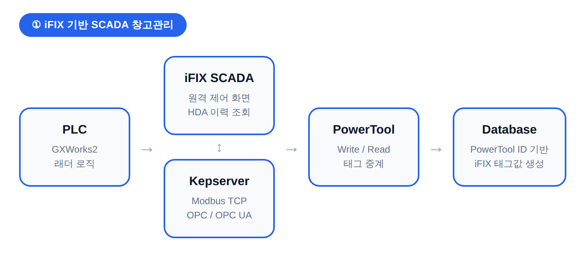
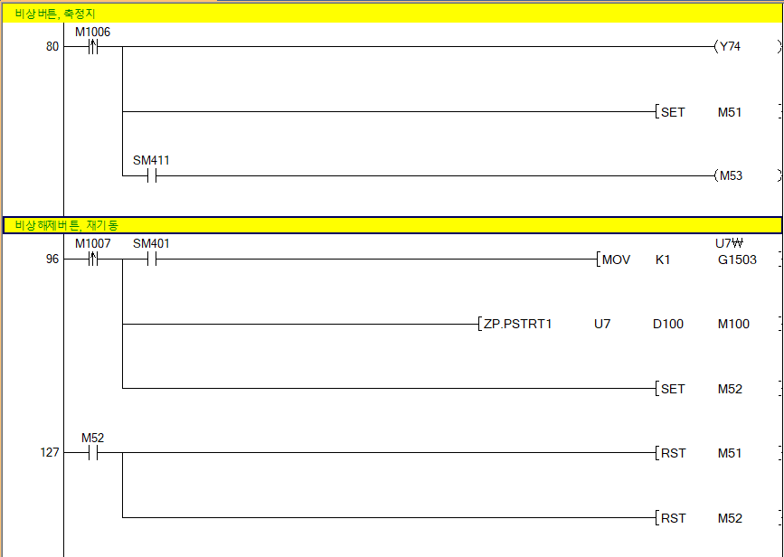
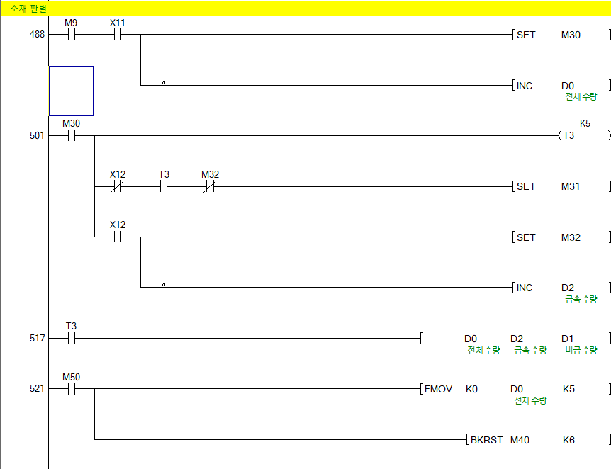
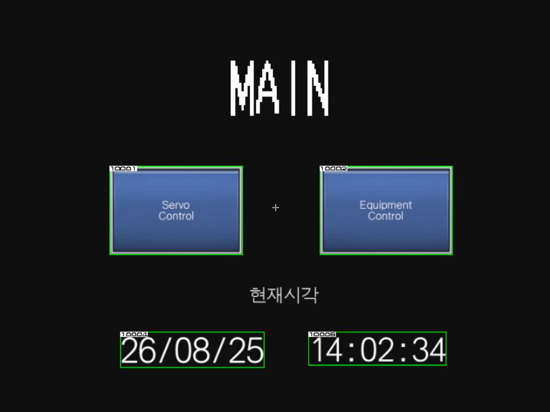
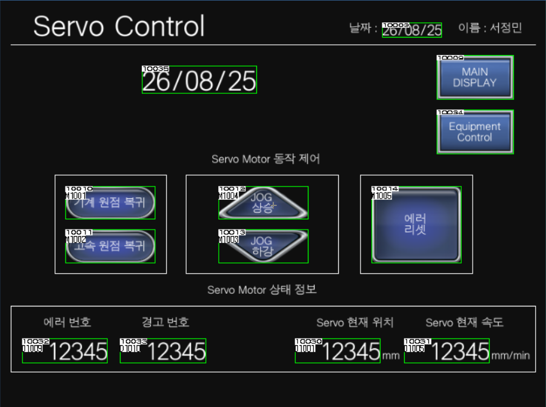
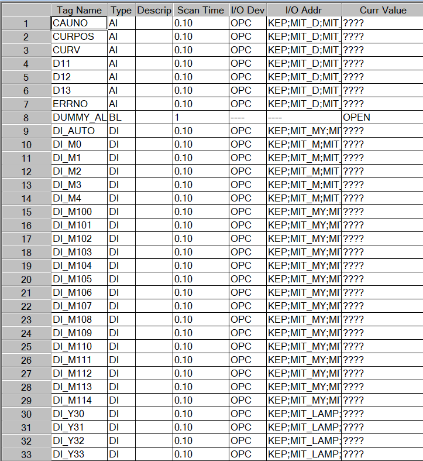
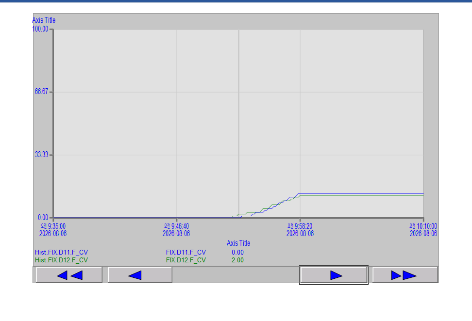
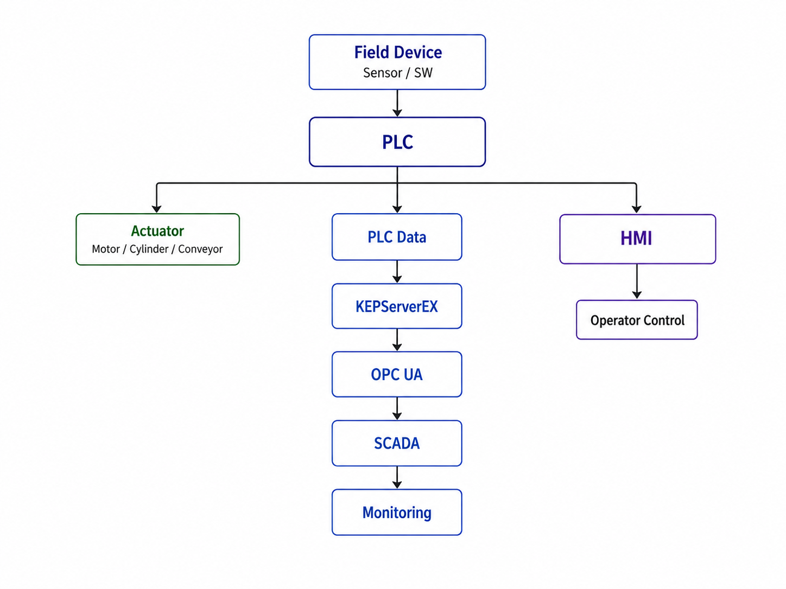

# PLC · HMI · SCADA 기반 자동화 제어 및 모니터링 시스템

### Mitsubishi PLC 제어 · GT Designer3 HMI · X-SCADA 상위 모니터링

> **센서·액추에이터 제어부터 자동 운전 시퀀스, HMI 운전 화면, Servo 위치제어, OPC UA 기반 SCADA 연동까지 구현하며
> Field Device → PLC → HMI → SCADA로 이어지는 산업자동화 시스템의 제어 및 데이터 흐름을 학습한 프로젝트**

* **PLC**: Mitsubishi PLC / GX Works2
* **HMI**: GT Designer3
* **SCADA**: X-SCADA
* **통신**: Ethernet / OPC UA
* **Middleware**: KEPServerEX
* **주요 제어 대상**: Sensor / Solenoid / Conveyor / MPS / Servo Motor

---

## 시스템 구성

<p align="center">
  
</p>

* **제어 흐름**
  `Sensor / Switch → PLC Sequence Logic → Actuator`

* **운전·모니터링 흐름**
  `Operator ↔ HMI ↔ PLC`

* **상위 데이터 흐름**
  `PLC → KEPServerEX → OPC UA → X-SCADA`

---

<details>
<summary><b>01. 프로젝트 개요</b></summary>

<br>

Mitsubishi PLC를 기반으로 센서·액추에이터의 **Digital I/O 제어와 자동 운전 시퀀스**를 구성하고, GT Designer3 HMI와 X-SCADA를 연동하여 설비의 **운전·제어·상태 모니터링 기능**을 구현했습니다.

PLC 프로그램 작성에 그치지 않고 HMI에서 작업자가 장비를 직접 조작하고 상태를 확인할 수 있도록 화면을 구성했으며, SCADA에서는 PLC 데이터를 수집하여 현장 설비의 상태를 상위 PC에서 모니터링할 수 있도록 연동했습니다.

또한 MPS 설비와 Servo Motor를 활용하여 센서 입력에 따른 순차 제어와 위치제어를 실습하며 PLC 프로그램이 실제 물리 장비의 동작으로 연결되는 과정을 확인했습니다.

이를 통해

```text
Field Device
     ↓
    PLC
     ↓
    HMI
     ↓
KEPServerEX
     ↓
   OPC UA
     ↓
  X-SCADA
```

로 이어지는 **산업자동화 시스템의 제어 계층과 데이터 흐름**을 학습했습니다.

</details>

---

<details>
<summary><b>02. 사용 기술 / 툴</b></summary>

<br>

| 구분             | 기술 / 툴                             |
| -------------- | ---------------------------------- |
| PLC            | Mitsubishi PLC / GX Works2         |
| HMI            | GT Designer3                       |
| SCADA          | X-SCADA                            |
| Communication  | Ethernet / OPC UA                  |
| OPC Server     | KEPServerEX                        |
| Control        | Digital I/O / Sequence Control     |
| Equipment      | Sensor / Solenoid / Conveyor / MPS |
| Motion Control | Servo Motor / Positioning Module   |

</details>

---

<details>
<summary><b>03. 주요 구현 내용</b></summary>

<br>

<details>
<summary><b>3-1. PLC 래더로직 설계 및 HMI 구현</b></summary>

<br>

GX Works2를 이용하여 센서와 스위치의 입력 상태를 확인하고, 조건에 따라 솔레노이드·램프·컨베이어 등의 출력 장치를 제어하는 PLC 프로그램을 구성했습니다.

GXWorks2를 활용해 스마트 창고관리 설비의 PLC 제어 로직을 설계하고, GTDesigner3로 현장 조작 및 상태 모니터링을 위한 HMI 화면을 구현했습니다.

SCADA 통합에 앞서 필드 계층인 PLC에서 제어 로직과 인터록을 먼저 완성한 뒤, 해당 디바이스를 기준으로 HMI와 iFIX를 단계적으로 연동했습니다.

#### PLC 래더로직 설계

MPS 창고관리 설비의 입·출고 컨베이어, 위치 감지 센서, 스토퍼 실린더, 소재 감지 센서, 랙 적재 상태 등을 제어 대상으로 기능별 로직을 구성했습니다.

| 기능 블록     | 주요 내용                           |
| --------- | ------------------------------- |
| 기동/정지 인터록 | 비상정지 및 초기 안전 조건 충족 시에만 설비 기동 허용 |
| 입출고 시퀀스   | 센서 입력 순서에 따라 컨베이어·스토퍼 순차 제어     |
| 위치/재고 판별  | 랙별 적재 상태를 판별해 저장 위치 결정          |
| 소재/수량 판별  | 금속·비금속 소재 구분 및 종류별 작업 수량 카운트    |

#### 기동/정지 인터록

<p align="center">
  
  
</p>

#### 입출고 시퀀스 제어

<p align="center">
  
</p>

#### 위치 / 재고 판별

<p align="center">
  
  
</p>

<details>
<summary><b>📎 전체 래더로직 보기</b></summary>

<br>

[PLC 래더로직 전체 PDF](프젝1이미지/PLC%20프로젝트%201_서정민.pdf)

</details>

<br>

#### HMI 화면 구현

GTDesigner3로 **MAIN · Servo Control · Equipment Control** 3개 화면을 구성하고, 상단 버튼을 통해 각 화면으로 전환할 수 있도록 구현했습니다.

|                   MAIN                   |               Servo Control              |             Equipment Control            |
| :--------------------------------------: | :--------------------------------------: | :--------------------------------------: |
|  |  |  |
|         서보/설비 제어 진입 및 현재 날짜·시각 표시        |    원점 복귀·JOG·에러 리셋 및 위치·속도·알람 상태 모니터링    |      가공 설정·비상정지·창고 적재 상태 및 작업 수량 표시      |

</details>

<br>

<details>
<summary><b>3-2. iFIX 기반 SCADA 창고관리 시스템</b></summary>

<br>

PLC·HMI 구현 이후 KEPServerEX를 이용해 PLC 데이터를 상위 SCADA 계층으로 연결했습니다.

KEPServerEX에서 **Modbus TCP · OPC · OPC UA** 통신 환경을 직접 구성하고, Mitsubishi PLC의 실제 디바이스 값을 OPC 태그로 가져와 통신 상태를 확인했습니다.

추가로 MQTT 및 MySQL 기반 데이터 처리 방식도 학습하고 적용했습니다.

#### 데이터 연결 구조

```text
PLC Device
    ↓
KEPServerEX OPC Tag
    ↓
iFIX I/O Driver
    ↓
iFIX Database Tag
    ↓
SCADA Screen
```

KEPServerEX에서 Mitsubishi PLC의 디바이스 영역별 OPC 그룹과 Item을 구성해 PLC 메모리를 OPC 태그로 노출했습니다.

이후 iFIX I/O Driver에서 해당 OPC Item을 참조하도록 태그를 매핑하고, DB Manager에서 실제 SCADA 화면에 사용할 태그와 설명을 구성해 최종 태그 데이터베이스를 완성했습니다.

<details>
<summary><b>📎 KEPServerEX / iFIX 태그 설정 화면 보기</b></summary>

<br>

#### KEPServerEX OPC 그룹 / Item 구성

<p align="center">
  
</p>

#### iFIX I/O Driver 태그 매핑

<p align="center">
  
</p>

#### iFIX DB Manager

<p align="center">
  
</p>

</details>

<br>

#### iFIX 화면 구현

iFIX에서도 HMI와 동일한 설비를 상위 계층에서 제어·모니터링할 수 있도록 **MAIN · Equipment Control · Servo Control · Trend** 화면을 구성했습니다.

상단 공통 Header에는 화면 전환 버튼, 현재 날짜·시각, Auto/Manual Mode 전환 기능을 배치했습니다.

|                    MAIN                   |             Equipment Control             |
| :---------------------------------------: | :---------------------------------------: |
|  |  |
|  공정 모식도, 축별 JOG 제어, Servo Position 실시간 표시 |        창고 적재 상태, 설비 상태 및 작업 수량 모니터링       |

|               Servo Control               |                   Trend                   |
| :---------------------------------------: | :---------------------------------------: |
|  |  |
|      JOG·원점복귀·에러 리셋 및 위치·속도·에러 상태 표시      |            HDA 기반 태그 이력 시계열 조회            |

HDA 기능을 이용해 사용자가 지정한 기간의 설비 태그 데이터를 조회하고 Trend 화면에서 시계열로 확인할 수 있도록 구성했습니다.

</details>

<br>

<details>
<summary><b>3-3. PLC · HMI · SCADA 전체 데이터 흐름</b></summary>

<br>

전체 시스템은 현장 장비, 제어 계층, 운전 계층, 상위 모니터링 계층이 연결되는 구조로 구성했습니다.

<p align="center">
  
</p>


이를 통해 단순 PLC 프로그램 작성이 아니라 **Field Device → PLC → HMI → OPC Server → SCADA로 이어지는 산업자동화 시스템의 계층 구조와 각 계층의 역할**을 경험했습니다.

</details>

</details>

---

<details>
<summary><b>04. 트러블슈팅 ⭐</b></summary>

<br>

<details>
<summary><b>Trouble 01. 금속·비금속 소재 판별 시 잘못된 수량 카운트</b></summary>

<br>

#### Problem

금속·비금속 소재를 구분해 종류별 수량을 카운트하는 과정에서 **비금속 판별 조건이 계속 SET 상태로 유지되며 실제 투입되지 않은 소재까지 수량 계산에 포함되는 문제**가 발생했습니다.

또한 D1·D2에 저장된 수량 값을 이용한 연산이 카운팅 완료 전에 수행되면서 이전 Scan의 값이 계산에 반영되는 현상도 확인했습니다.

#### Analysis

래더 로직을 PLC Scan 순서 기준으로 추적한 결과 두 가지 원인을 확인했습니다.

* 금속과 비금속 판별 조건 사이에 상호 배타 조건이 없어 두 상태가 동시에 영향을 줄 수 있었음
* 수량 연산 시점이 실제 카운트 값이 확정되는 시점보다 빨랐음

즉, 단순히 조건이 맞는지가 아니라 **한 Scan 안에서 신호와 연산 결과가 어떤 순서로 반영되는지**가 문제의 핵심이었습니다.

#### Solution

* 금속·비금속 판별 조건 사이에 **인터록 추가**
* 실제 금속·비금속 감지 여부를 수량 판정 조건에 추가해 오카운트 방지
* D1·D2 연산 시점을 X13 조건 진입 이전 단계로 이동
* 카운팅 값이 확정된 이후에만 연산되도록 로직 수정

#### Result

잘못된 SET 유지와 오카운트를 제거하고, 실제 소재 종류와 수량에 따라 설비가 정상적으로 기동하도록 로직을 안정화했습니다.

> **Learned**
> PLC 로직에서는 조건의 충족 여부뿐 아니라 **해당 조건과 데이터가 어느 Scan에서 확정되는지까지 고려해야 한다는 점**을 배웠습니다.

</details>

<br>

<details>
<summary><b>Trouble 02. iFIX 값은 변경되지만 실제 PLC가 동작하지 않는 문제</b></summary>

<br>

#### Problem

iFIX SCADA 화면에서 DO 태그를 조작하면 Database 값은 정상적으로 변경됐지만, 실제 PLC와 MPS 설비가 동작하지 않는 문제가 발생했습니다.

태그 주소와 KEPServerEX 설정을 다시 확인했지만 설정상 오류는 발견되지 않았습니다.

#### Analysis

단일 태그 설정이 아닌 전체 데이터 흐름 문제라고 판단해 신호 전달 경로를 역순으로 추적했습니다.

```text
iFIX Database
      ↓
   PowerTool
      ↓
 KEPServerEX
      ↓
     PLC
```

각 계층에서 값을 확인한 결과 다음 상태를 확인했습니다.

| 확인 구간           | 상태          |
| --------------- | ----------- |
| iFIX Database   | DO Write 정상 |
| PowerTool Write | 값 입력 확인     |
| PowerTool Read  | 값 없음        |
| PLC             | 신호 미도달      |

이를 통해 DO 태그에 기록된 값이 **PowerTool 단계에서 Read되지 않아 KEPServerEX와 PLC까지 전달되지 않는 것**이 원인임을 파악했습니다.

#### Solution

iFIX Database에 DO 태그와 대응되는 **DI 태그를 추가해 Write → Read 사이클을 구성**했습니다.

이후 각 계층의 값을 단계별로 확인하면서 PowerTool → KEPServerEX → PLC까지 신호가 정상적으로 전달되는지 검증했습니다.

#### Result

iFIX 화면에서 MPS 설비를 정상적으로 원격 구동할 수 있게 되었으며, PLC-HMI-SCADA 전체 계층의 양방향 데이터 통신을 완성했습니다.

> **Learned**
> SCADA 시스템을 하나의 태그 문제가 아니라
> **PLC ↔ 통신 Driver ↔ Middleware ↔ Database ↔ SCADA**로 이어지는 하나의 데이터 파이프라인으로 바라보는 관점을 익혔습니다.

</details>

</details>

---

<details>
<summary><b>05. 결과 및 성과</b></summary>

<br>

* Mitsubishi PLC 기반 **Digital I/O 제어 로직 구현**
* Timer / Counter / SET-RST / 인터록을 이용한 **자동 운전 시퀀스 구성**
* **Auto / Manual Mode**를 구분한 설비 운전 로직 구현
* Sensor / Solenoid / Conveyor 등 **실제 Field Device 연동**
* MPS 장비를 이용한 **순차 공정 제어**
* Positioning Module과 Servo Motor를 이용한 **JOG 및 위치제어 실습**
* GT Designer3 기반 **HMI 운전·모니터링 화면 구현**
* **HMI ↔ PLC 양방향 데이터 연동**
* Lamp / Numerical Display / Graph / Alarm History 등 HMI 기능 구현
* KEPServerEX를 이용한 **PLC Device → OPC Tag 변환**
* **OPC UA 기반 X-SCADA 데이터 연동**
* 현장 PLC 데이터를 상위 PC에서 확인할 수 있는 **SCADA 모니터링 환경 구성**
* **Field Device → PLC → HMI → OPC → SCADA** 전체 데이터 흐름 이해

</details>

---

<details>
<summary><b>06. 회고 / 배운 점</b></summary>

<br>

이번 실습을 통해 PLC 프로그램은 단순히 래더로직을 작성하는 작업이 아니라, **실제 센서 입력과 액추에이터 동작을 조건과 순서에 맞게 연결하는 설비 제어의 중심 역할**이라는 점을 이해했습니다.

특히 자동 운전 시퀀스를 구성하면서 한 단계의 동작 완료 조건이 다음 단계의 시작 조건이 되는 구조를 구현했고, Manual / Auto Mode를 구분하면서 실제 산업 설비에서 점검 운전과 자동 생산 운전이 어떻게 분리되는지도 확인했습니다.

GT Designer3 HMI를 PLC와 연결하면서는 PLC 내부의 Bit·Word Device가 작업자 관점에서는 버튼, 램프, 수치, 알람과 같은 **운전 인터페이스로 변환되는 과정**을 경험했습니다.

또한 HMI Alternate Switch와 PLC 자기유지 로직이 충돌했던 문제를 해결하면서 단순히 Device Address를 연결하는 것보다 **하나의 신호를 어느 계층에서 생성하고 유지할 것인지 제어 주체를 명확하게 정의하는 것이 중요하다는 점**을 배웠습니다.

Servo 위치제어에서는 원점 복귀와 현재 위치 관리의 중요성을 확인했으며, KEPServerEX와 OPC UA를 이용한 X-SCADA 연동을 통해 PLC의 현장 데이터가 상위 모니터링 시스템까지 전달되는 구조를 직접 구성했습니다.

결과적으로 개별 PLC 기능에 대한 실습을 넘어

**Field Device → PLC → HMI → Communication → SCADA**

로 이어지는 전체 자동화 시스템을 하나의 데이터 및 제어 흐름으로 바라보는 관점을 익혔습니다.

</details>
