# 산업용 제어·모니터링 시스템 2종 구축

### iFIX SCADA 창고관리 + Cognex 비전 품질검사 자동화

> **PLC · HMI · SCADA · Vision · C# · Arduino를 연계해
> 모니터링부터 품질 판정 및 실제 설비 제어까지 구현한 산업자동화 프로젝트**

* **기간**: 2026.03 - 04 / 2026.07 - 08
* **참여 형태**: 개인
* **주요 기술**: Mitsubishi PLC, GXWorks2, GTDesigner3, iFIX, KEPServerEX, Cognex Vision, C#, Arduino

---

## 시스템 구성

<p align="center">
  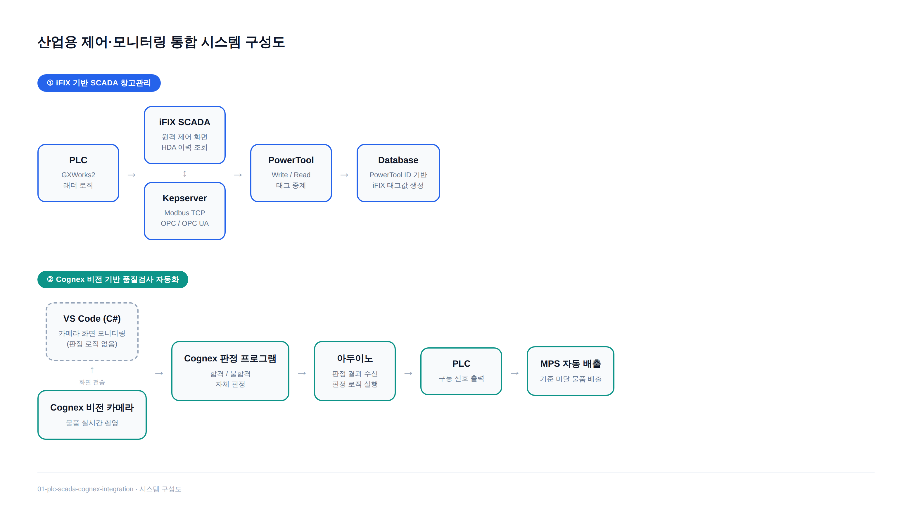
</p>

* **SCADA 데이터 흐름**
  `PLC → KEPServerEX → PowerTool → iFIX Database`

* **비전검사 자동화 흐름**
  `Cognex Vision Camera → C# 판정 → Arduino → PLC → MPS 자동 배출`

---

<details>
<summary><b>01. 프로젝트 개요 및 문제 정의</b></summary>

<br>

대한상공회의소 산업자동화 실습 과정에서 성격이 다른 두 가지 제어·모니터링 시스템을 구축했습니다.

1. **PLC · HMI · SCADA(iFIX)를 통합한 스마트 창고관리 시스템**
2. **Cognex 비전 카메라와 PLC · Arduino를 연동한 품질검사 자동화 시스템**

PLC 로직만으로는 현장 데이터를 실시간으로 모니터링하고 이력을 관리하는 데 한계가 있었고, 품질검사 공정은 육안 검사에 의존하고 있어 자동화가 필요했습니다.

이에 따라 첫 번째 프로젝트에서는 **PLC-HMI-SCADA를 하나의 데이터 흐름으로 통합한 창고관리 시스템**을 구축했고, 두 번째 프로젝트에서는 **비전 검사 결과가 실제 설비의 자동 배출 동작까지 이어지는 품질검사 자동화 시스템**을 구현했습니다.

</details>

---

<details>
<summary><b>02. 사용 기술 / 툴</b></summary>

<br>

| 구분          | 기술 / 툴                             |
| ----------- | ---------------------------------- |
| PLC         | Mitsubishi PLC, GXWorks2           |
| HMI         | GTDesigner3                        |
| SCADA       | iFIX                               |
| 통신          | Modbus TCP, OPC, OPC UA, MQTT, HDA |
| Middleware  | KEPServerEX                        |
| DB          | MySQL                              |
| Vision      | Cognex Vision Camera               |
| Programming | C#                                 |
| Hardware    | Arduino, MPS 설비                    |

</details>

---

<details>
<summary><b>03. 주요 구현 내용</b></summary>

<br>

### 3-1. PLC 래더로직 설계 및 HMI 구현

GXWorks2를 활용해 스마트 창고관리 설비의 PLC 제어 로직을 설계하고, GTDesigner3로 현장 조작 및 상태 모니터링을 위한 HMI 화면을 구현했습니다.

SCADA 통합에 앞서 필드 계층인 PLC에서 제어 로직과 인터록을 먼저 완성한 뒤, 해당 디바이스를 기준으로 HMI와 iFIX를 단계적으로 연동했습니다.

#### PLC 래더로직 설계

MPS 창고관리 설비의 입·출고 컨베이어, 위치 감지 센서, 스토퍼 실린더, 소재 감지 센서, 랙 적재 상태 등을 제어 대상으로 기능별 로직을 구성했습니다.

| 기능 블록     | 주요 내용                           |
| --------- | ------------------------------- |
| 기동/정지 인터록 | 비상정지 및 초기 안전 조건 충족 시에만 설비 기동 허용 |
| 입출고 시퀀스   | 센서 입력 순서에 따라 컨베이어·스토퍼 순차 제어     |
| 위치/재고 판별  | 랙별 적재 상태를 판별해 저장 위치 결정          |
| 소재/수량 판별  | 금속·비금속 소재 구분 및 종류별 작업 수량 카운트    |

#### 기동/정지 인터록

<p align="center">
  
  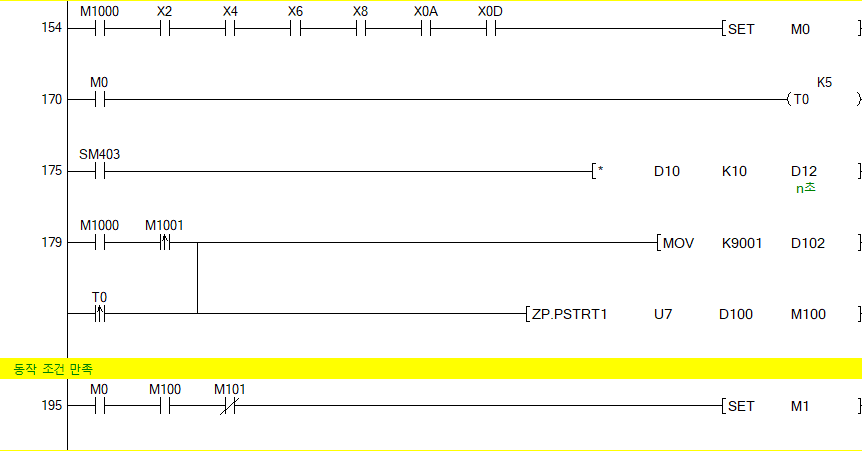
</p>

#### 입출고 시퀀스 제어

<p align="center">
  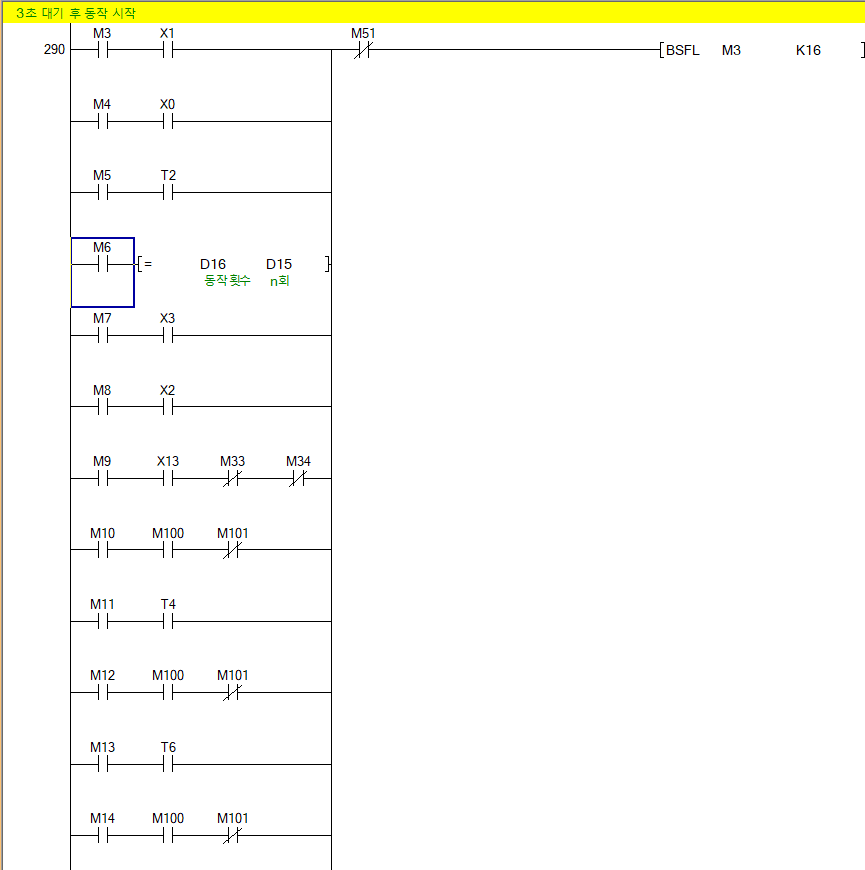
</p>

#### 위치 / 재고 판별

<p align="center">
  
  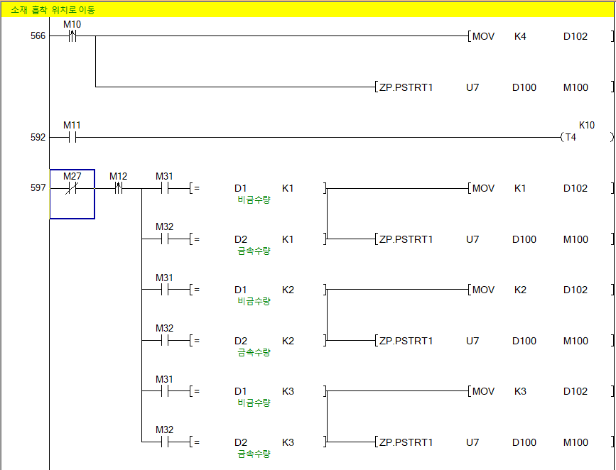
</p>

<details>
<summary><b>📎 전체 래더로직 보기</b></summary>

<br>

[PLC 래더로직 전체 PDF](프젝1이미지/PLC%20프로젝트%201_서정민.pdf)

</details>

<br>

#### HMI 화면 구현

GTDesigner3로 **MAIN · Servo Control · Equipment Control** 3개 화면을 구성하고, 상단 버튼을 통해 각 화면으로 전환할 수 있도록 구현했습니다.

|                   MAIN                   |               Servo Control              |             Equipment Control            |
| :--------------------------------------: | :--------------------------------------: | :--------------------------------------: |
|  |  | 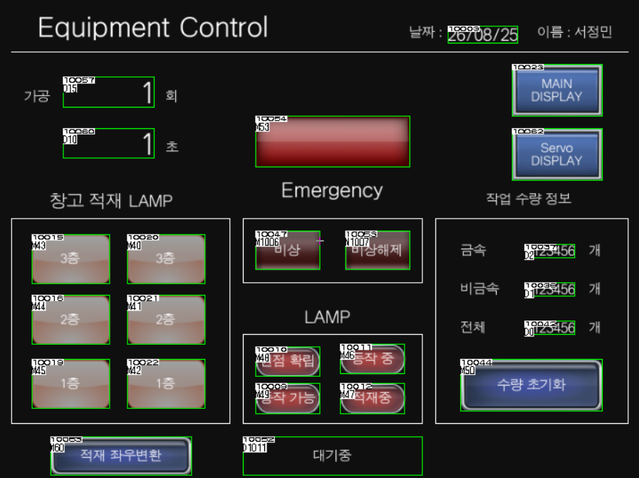 |
|         서보/설비 제어 진입 및 현재 날짜·시각 표시        |    원점 복귀·JOG·에러 리셋 및 위치·속도·알람 상태 모니터링    |      가공 설정·비상정지·창고 적재 상태 및 작업 수량 표시      |

---

### 3-2. iFIX 기반 SCADA 창고관리 시스템

PLC·HMI 구현 이후 KEPServerEX를 이용해 PLC 데이터를 상위 SCADA 계층으로 연결했습니다.

KEPServerEX에서 **Modbus TCP · OPC · OPC UA** 통신 환경을 직접 구성하고, Mitsubishi PLC의 실제 디바이스 값을 OPC 태그로 가져와 통신 상태를 확인했습니다.

추가로 MQTT 및 MySQL 기반 데이터 처리 방식도 학습하고 적용했습니다.

#### 데이터 연결 구조

```text
PLC Device
    ↓
KEPServerEX OPC Tag
    ↓
iFIX I/O Driver
    ↓
iFIX Database Tag
    ↓
SCADA Screen
```

KEPServerEX에서 Mitsubishi PLC의 디바이스 영역별 OPC 그룹과 Item을 구성해 PLC 메모리를 OPC 태그로 노출했습니다.

이후 iFIX I/O Driver에서 해당 OPC Item을 참조하도록 태그를 매핑하고, DB Manager에서 실제 SCADA 화면에 사용할 태그와 설명을 구성해 최종 태그 데이터베이스를 완성했습니다.

<details>
<summary><b>📎 KEPServerEX / iFIX 태그 설정 화면 보기</b></summary>

<br>

#### KEPServerEX OPC 그룹 / Item 구성

<p align="center">
  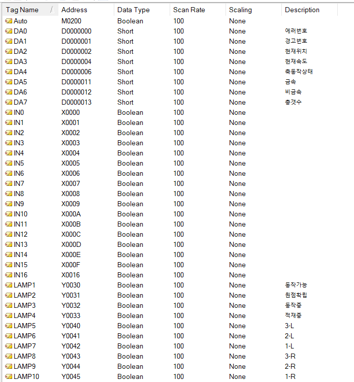
</p>

#### iFIX I/O Driver 태그 매핑

<p align="center">
  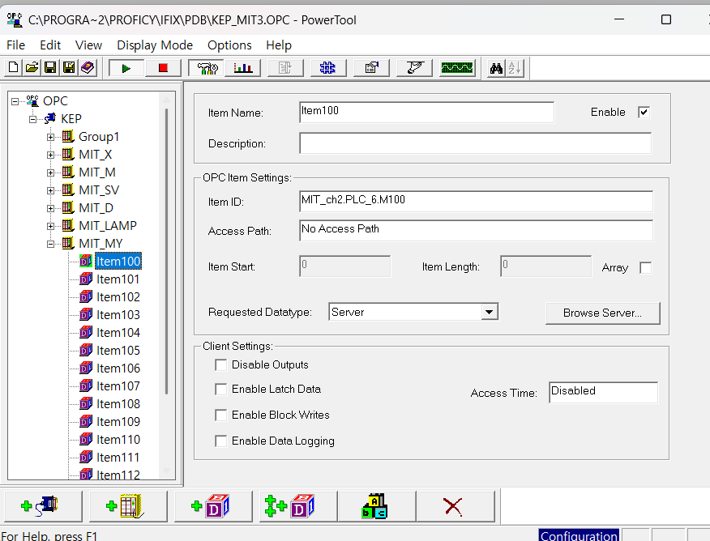
</p>

#### iFIX DB Manager

<p align="center">
  
</p>

</details>

<br>

#### iFIX 화면 구현

iFIX에서도 HMI와 동일한 설비를 상위 계층에서 제어·모니터링할 수 있도록 **MAIN · Equipment Control · Servo Control · Trend** 화면을 구성했습니다.

상단 공통 Header에는 화면 전환 버튼, 현재 날짜·시각, Auto/Manual Mode 전환 기능을 배치했습니다.

|                    MAIN                   |             Equipment Control             |
| :---------------------------------------: | :---------------------------------------: |
| 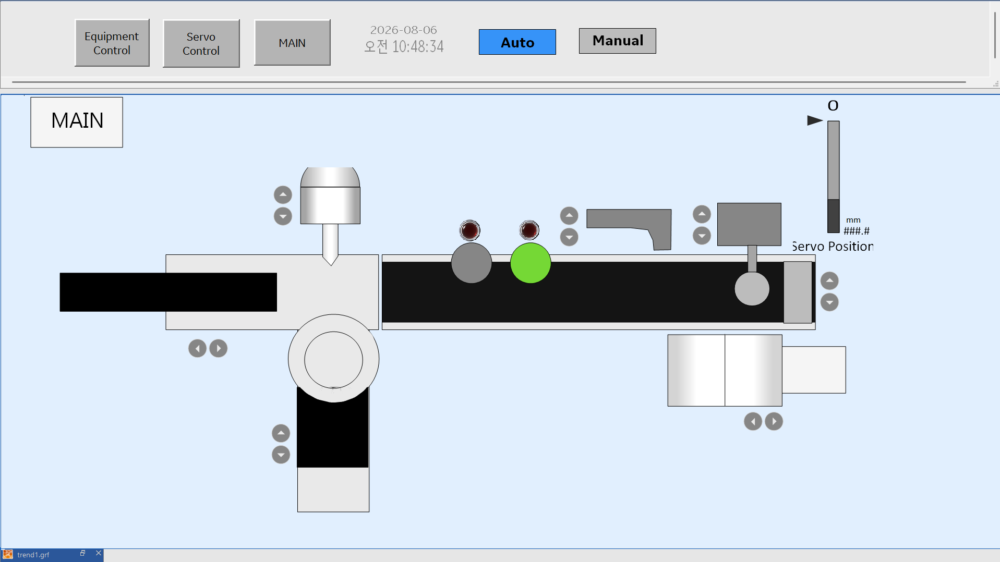 | 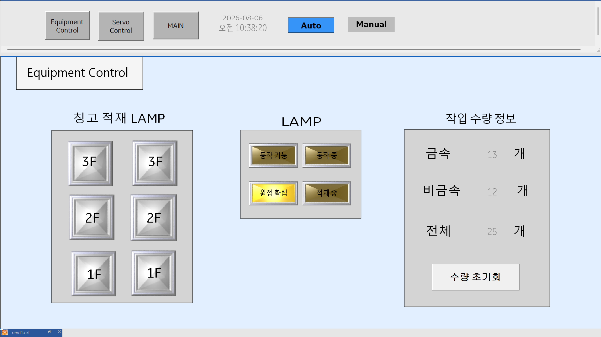 |
|  공정 모식도, 축별 JOG 제어, Servo Position 실시간 표시 |        창고 적재 상태, 설비 상태 및 작업 수량 모니터링       |

|               Servo Control               |                   Trend                   |
| :---------------------------------------: | :---------------------------------------: |
| 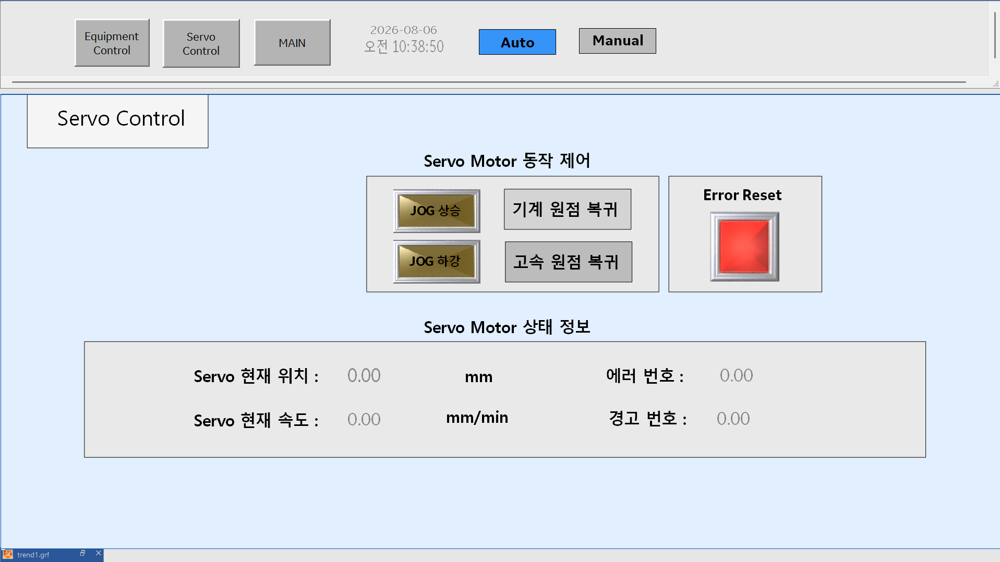 |  |
|      JOG·원점복귀·에러 리셋 및 위치·속도·에러 상태 표시      |            HDA 기반 태그 이력 시계열 조회            |

HDA 기능을 이용해 사용자가 지정한 기간의 설비 태그 데이터를 조회하고 Trend 화면에서 시계열로 확인할 수 있도록 구성했습니다.

---

### 3-3. Cognex 비전 기반 품질검사 자동화

Cognex 비전 카메라를 C# 프로그램과 연동해 물품을 실시간으로 촬영하고 품질을 판정하는 시스템을 구축했습니다.

**PatMax 패턴 매칭 · Blob 검출 · QR Code 판독 결과**를 프로그램에서 실시간으로 모니터링하고, 판정 결과를 Arduino와 PLC로 전달해 기준 미달 제품이 검출될 경우 MPS 설비에서 자동 배출되도록 구현했습니다.

#### 제어 흐름

```text
Cognex Vision Camera
        ↓
   C# 판정 로직
        ↓
     Arduino
        ↓
       PLC
        ↓
 MPS 자동 배출
```

이를 통해 비전 판정 결과가 소프트웨어 내부에서 끝나는 것이 아니라 실제 물리 설비의 동작까지 연결되는 하나의 자동화 제어 루프를 완성했습니다.

|                     비전검사 제어 프로그램                     |                   실제 장비 연동                  |
| :--------------------------------------------------: | :-----------------------------------------: |
|             |  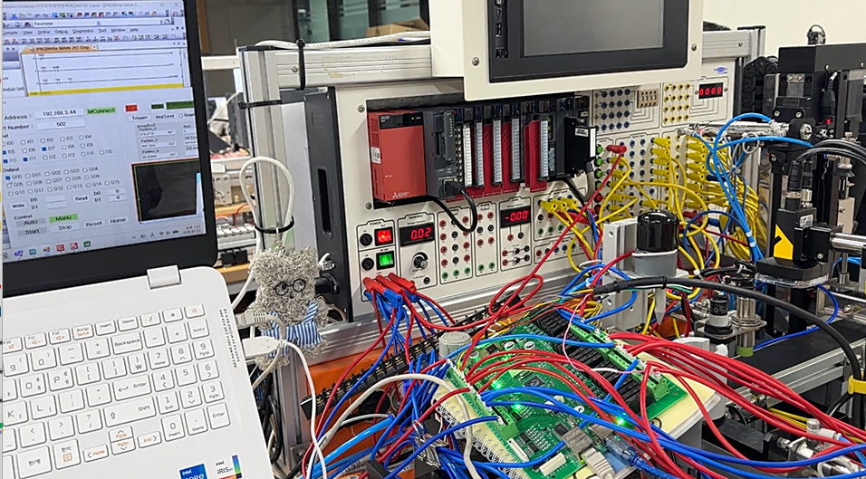  |
| Modbus TCP 기반 PLC 통신 및 PatMax·Blob·QR 판독 결과 실시간 모니터링 | PLC·Vision Camera·Arduino·MPS 설비 실제 배선 및 구동 |

</details>

---

<details>
<summary><b>04. 트러블슈팅 ⭐</b></summary>

<br>

### Trouble 01. 금속·비금속 소재 판별 시 잘못된 수량 카운트

#### Problem

금속·비금속 소재를 구분해 종류별 수량을 카운트하는 과정에서 **비금속 판별 조건이 계속 SET 상태로 유지되며 실제 투입되지 않은 소재까지 수량 계산에 포함되는 문제**가 발생했습니다.

또한 D1·D2에 저장된 수량 값을 이용한 연산이 카운팅 완료 전에 수행되면서 이전 Scan의 값이 계산에 반영되는 현상도 확인했습니다.

#### Analysis

래더 로직을 PLC Scan 순서 기준으로 추적한 결과 두 가지 원인을 확인했습니다.

* 금속과 비금속 판별 조건 사이에 상호 배타 조건이 없어 두 상태가 동시에 영향을 줄 수 있었음
* 수량 연산 시점이 실제 카운트 값이 확정되는 시점보다 빨랐음

즉, 단순히 조건이 맞는지가 아니라 **한 Scan 안에서 신호와 연산 결과가 어떤 순서로 반영되는지**가 문제의 핵심이었습니다.

#### Solution

* 금속·비금속 판별 조건 사이에 **인터록 추가**
* 실제 금속·비금속 감지 여부를 수량 판정 조건에 추가해 오카운트 방지
* D1·D2 연산 시점을 X13 조건 진입 이전 단계로 이동
* 카운팅 값이 확정된 이후에만 연산되도록 로직 수정

#### Result

잘못된 SET 유지와 오카운트를 제거하고, 실제 소재 종류와 수량에 따라 설비가 정상적으로 기동하도록 로직을 안정화했습니다.

> **Learned**
> PLC 로직에서는 조건의 충족 여부뿐 아니라 **해당 조건과 데이터가 어느 Scan에서 확정되는지까지 고려해야 한다는 점**을 배웠습니다.

---

### Trouble 02. iFIX 값은 변경되지만 실제 PLC가 동작하지 않는 문제

#### Problem

iFIX SCADA 화면에서 DO 태그를 조작하면 Database 값은 정상적으로 변경됐지만, 실제 PLC와 MPS 설비가 동작하지 않는 문제가 발생했습니다.

태그 주소와 KEPServerEX 설정을 다시 확인했지만 설정상 오류는 발견되지 않았습니다.

#### Analysis

단일 태그 설정이 아닌 전체 데이터 흐름 문제라고 판단해 신호 전달 경로를 역순으로 추적했습니다.

```text
iFIX Database
      ↓
   PowerTool
      ↓
 KEPServerEX
      ↓
     PLC
```

각 계층에서 값을 확인한 결과 다음 상태를 확인했습니다.

| 확인 구간           | 상태          |
| --------------- | ----------- |
| iFIX Database   | DO Write 정상 |
| PowerTool Write | 값 입력 확인     |
| PowerTool Read  | 값 없음        |
| PLC             | 신호 미도달      |

이를 통해 DO 태그에 기록된 값이 **PowerTool 단계에서 Read되지 않아 KEPServerEX와 PLC까지 전달되지 않는 것**이 원인임을 파악했습니다.

#### Solution

iFIX Database에 DO 태그와 대응되는 **DI 태그를 추가해 Write → Read 사이클을 구성**했습니다.

이후 각 계층의 값을 단계별로 확인하면서 PowerTool → KEPServerEX → PLC까지 신호가 정상적으로 전달되는지 검증했습니다.

#### Result

iFIX 화면에서 MPS 설비를 정상적으로 원격 구동할 수 있게 되었으며, PLC-HMI-SCADA 전체 계층의 양방향 데이터 통신을 완성했습니다.

> **Learned**
> SCADA 시스템을 하나의 태그 문제가 아니라
> **PLC ↔ 통신 Driver ↔ Middleware ↔ Database ↔ SCADA**로 이어지는 하나의 데이터 파이프라인으로 바라보는 관점을 익혔습니다.

</details>

---

<details>
<summary><b>05. 결과 및 성과</b></summary>

<br>

* **Modbus TCP · OPC · OPC UA 3종 통신 환경 직접 구성**
* Mitsubishi PLC의 실제 태그값 연동 및 통신 확인
* **PLC-HMI-SCADA 전체 계층 통합**
* iFIX 기반 MPS 설비 원격 제어 구현
* **HDA 기반 설비 이력 조회 및 Trend 시각화**
* **Cognex Vision · C# · Arduino · PLC · MPS 통합 연동**
* 기준 미달 제품 **실시간 판정 및 자동 배출 동작 검증**
* PLC Scan Cycle 및 SCADA Data Flow 기반 **계층별 트러블슈팅 경험 확보**

</details>

---

<details>
<summary><b>06. 회고 / 배운 점</b></summary>

<br>

두 프로젝트를 통해 데이터 모니터링 중심의 SCADA 시스템과 실시간 제어 중심의 비전 검사 자동화 시스템을 구축하며, 개별 장비 제어를 넘어 **필드-제어-통신-모니터링 계층을 하나의 시스템으로 통합하는 경험**을 쌓았습니다.

PLC 프로젝트에서는 소재 판별, 수량 연산, 반복 횟수 제어 과정에서 발생한 문제를 해결하며 조건의 참·거짓뿐 아니라 **Scan Cycle과 신호 반영 시점까지 고려한 시퀀스 설계의 중요성**을 배웠습니다.

SCADA 프로젝트에서는 PLC부터 KEPServerEX, PowerTool, iFIX Database까지 데이터 전달 경로를 직접 추적하며 문제를 개별 태그가 아닌 **End-to-End 데이터 흐름 관점에서 분석하는 방법**을 익혔습니다.

또한 Cognex Vision의 판정 결과를 C#·Arduino·PLC와 연결해 실제 MPS 설비의 동작까지 이어지도록 구현하면서, **서로 다른 프로토콜·언어·하드웨어를 하나의 제어 루프로 통합하는 시스템 Integration 역량**을 강화했습니다.

</details>

