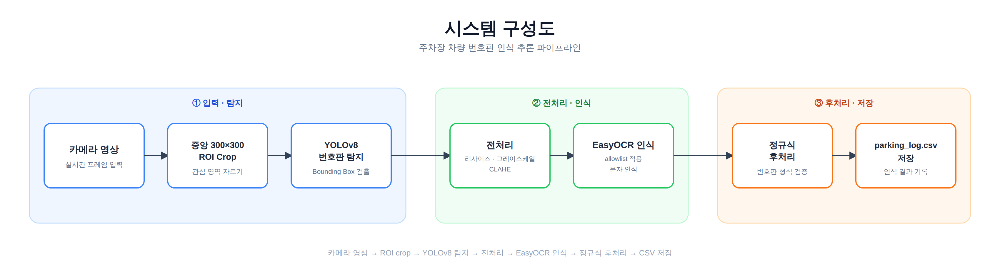
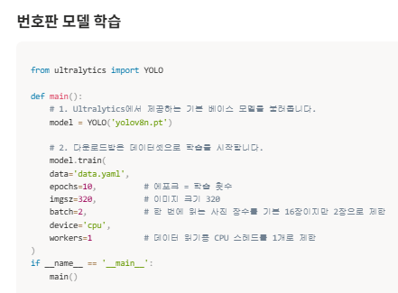
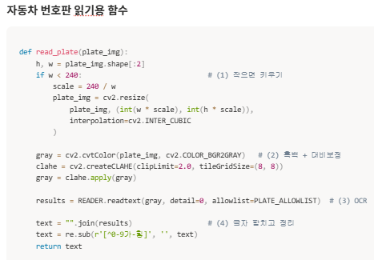
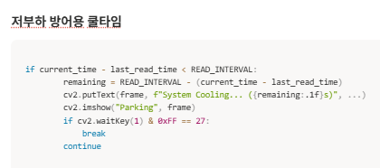
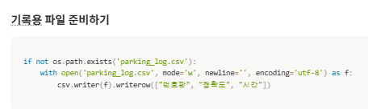
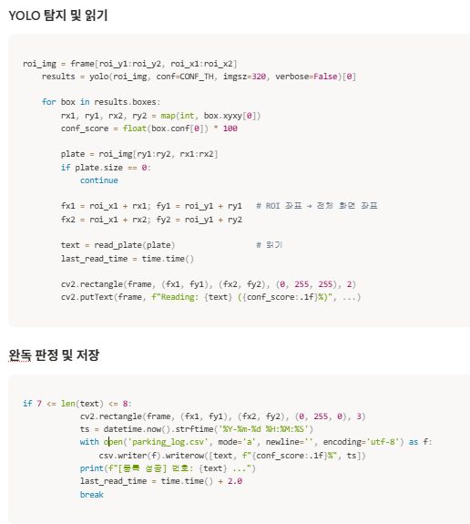
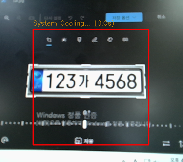
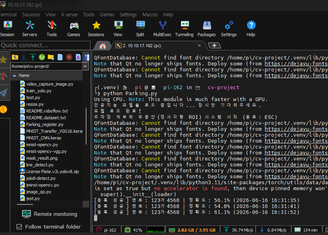

# Raspberry Pi5 · YOLOv8 기반 실시간 차량 번호판 인식 주차관리 시스템

### CPU-only 엣지 디바이스 환경에서 YOLOv8 · EasyOCR을 활용한 실시간 번호판 탐지·인식 시스템

> **GPU 서버 없이 Raspberry Pi5에서 YOLOv8과 EasyOCR을 구동해
> 차량 번호판 탐지 → 문자 인식 → 후처리 → 출입 기록 저장까지 구현한 Edge AI 프로젝트**

* **기간**: 2026.05 ~ 2026.06
* **참여 형태**: 개인 프로젝트
* **담당 역할**: 기획 · 데이터 구성 · 모델 학습 · 최적화 · 배포 전 과정 단독 수행
* **주요 기술**: Python, YOLOv8, EasyOCR, OpenCV, Raspberry Pi5, Linux, SSH

---

## 시스템 구성

<p align="center">
  
</p>

* **실시간 추론 파이프라인**

  `Camera → 300×300 ROI → YOLOv8 → Image Preprocessing → EasyOCR → Regex → CSV`

* **실행 환경**

  `Raspberry Pi5 (CPU-only) → Linux · venv → Python`

---

<details>
<summary><b>01. 프로젝트 개요 및 문제 정의</b></summary>

<br>

딥러닝 수업 최종 프로젝트로, **GPU 서버가 아닌 Raspberry Pi5와 같은 저사양 엣지 디바이스에서도 실시간으로 동작하는 차량 출입 자동화 시스템**을 구현했습니다.

카메라 영상에서 차량 번호판을 탐지하고 문자를 인식한 뒤, 최종 번호판 정보를 CSV에 자동 기록하는 End-to-End 비전 파이프라인 구축을 목표로 했습니다.

프로젝트 진행 전에는 Hough Transform 기반 차선 검출을 학습하고 이를 CNN 기반 접근으로 확장하며 영상처리 및 딥러닝 파이프라인의 기초를 익혔습니다.

이후 해당 경험을 바탕으로 Raspberry Pi5 환경에서

**YOLOv8 객체 탐지 + EasyOCR 문자 인식 + OpenCV 전처리**

를 결합한 실시간 번호판 인식 시스템을 구현했습니다.

### 핵심 과제

Raspberry Pi5는 별도의 GPU 없이 CPU만으로 추론해야 했기 때문에 다음 두 가지를 핵심 문제로 설정했습니다.

1. **제한된 CPU·메모리 환경에서도 실시간 추론이 가능한 구조 설계**
2. **번호판 탐지 이후 OCR까지 안정적으로 연결해 최종 번호판 문자열 확보**

</details>

---

<details>
<summary><b>02. 사용 기술 / 툴</b></summary>

<br>

| 구분                 | 기술 / 툴                             |
| ------------------ | ---------------------------------- |
| Language           | Python                             |
| OS / Environment   | Linux CLI, venv                    |
| Object Detection   | YOLOv8, Ultralytics                |
| Base Model         | yolov8n.pt                         |
| OCR                | EasyOCR (ko / en)                  |
| Image Processing   | OpenCV                             |
| 전처리                | ROI Crop, Resize, Grayscale, CLAHE |
| 영상처리 학습            | Hough Transform, CNN 기반 차선 검출      |
| Hardware           | Raspberry Pi5 (CPU-only)           |
| Remote Development | MobaXTerm, SSH                     |
| Data Storage       | CSV (`parking_log.csv`)            |
| Memory Management  | `gc.collect()`, Torch Cache 정리     |

</details>

---

<details>
<summary><b>03. 주요 구현 내용</b></summary>

<br>

<details>
<summary><b>3-1. YOLOv8 전이학습 및 저사양 환경 최적화</b></summary>

<br>

YOLOv8의 경량 모델인 **`yolov8n.pt`**를 기반으로 커스텀 번호판 데이터셋을 전이학습했습니다.

Raspberry Pi5는 GPU 없이 CPU만으로 추론해야 했기 때문에 모델 성능만 높이는 것이 아니라 **연산량과 처리 속도 사이의 Trade-off**를 고려해 학습 및 추론 환경을 구성했습니다.

#### 학습 설정

| Parameter  |        설정값 | 적용 이유                  |
| ---------- | ---------: | ---------------------- |
| Model      | yolov8n.pt | YOLOv8 모델 중 경량 모델 선택   |
| Epochs     |         10 | 학습 시간 및 리소스 사용량 고려     |
| Image Size |        320 | 입력 연산량 감소              |
| Batch      |          2 | 기본값 대비 메모리 사용량 축소      |
| Device     |        CPU | Raspberry Pi5 실행 환경 반영 |
| Workers    |          1 | 병렬 처리에 따른 리소스 사용 억제    |

<p align="center">
  
</p>

</details>

<br>

<details>
<summary><b>3-2. ROI 기반 실시간 추론 구조 설계</b></summary>

<br>

전체 카메라 프레임을 YOLOv8에 그대로 입력하면 Raspberry Pi5에서 처리해야 할 연산량이 커지기 때문에, 차량 번호판이 진입할 영역을 기준으로 **화면 중앙 300×300 ROI만 Crop해 추론하는 방식**을 적용했습니다.

```text
Camera Frame
     ↓
Center 300 × 300 ROI Crop
     ↓
YOLOv8 Detection
```

전체 영상이 아닌 필요한 영역만 추론함으로써 불필요한 픽셀 연산을 줄이고 CPU 환경에서의 실시간 처리 부담을 낮췄습니다.

</details>

<br>

<details>
<summary><b>3-3. EasyOCR 인식 정확도 개선</b></summary>

<br>

YOLOv8이 탐지한 번호판 영역을 그대로 OCR에 전달하지 않고, EasyOCR의 문자 인식 성능을 높이기 위한 전처리 과정을 적용했습니다.

#### OCR 전처리

```text
Detected License Plate
        ↓
      Resize
        ↓
    Grayscale
        ↓
      CLAHE
        ↓
     EasyOCR
        ↓
     Allowlist
        ↓
      Regex
        ↓
 Final Plate Number
```

적용한 주요 방법은 다음과 같습니다.

* 번호판 폭이 **240px 미만인 경우 확대**
* 컬러 영상을 **Grayscale**로 변환
* **CLAHE**를 적용해 번호판 문자와 배경의 대비 향상
* 한글 자모 및 숫자로 구성된 **Allowlist**를 적용해 불필요한 문자 인식 제한
* OCR 결과에 **정규식 후처리**를 적용해 번호판 형식에 맞게 문자열 정제

<p align="center">
  
</p>

</details>

<br>

<details>
<summary><b>3-4. 차량 번호 인식 및 출입 기록 자동화</b></summary>

<br>

번호판이 정상적으로 인식되면 결과를 별도의 `parking_log.csv` 파일에 즉시 Append하도록 구현했습니다.

```text
번호판 탐지
    ↓
OCR 문자 인식
    ↓
문자열 검증
    ↓
parking_log.csv 저장
```

프로그램 종료 시 일괄 저장하는 방식이 아닌 **인식 직후 저장하는 구조**를 적용해 예기치 않은 프로그램 종료가 발생하더라도 이미 인식한 차량 기록이 유실되지 않도록 했습니다.

</details>

<br>

<details>
<summary><b>3-5. Raspberry Pi5 원격 개발 및 배포</b></summary>

<br>

MobaXTerm을 이용해 Raspberry Pi5에 SSH로 원격 접속하고, Linux 환경에서 프로젝트를 개발·테스트했습니다.

Python 라이브러리 의존성을 분리하기 위해 **venv 가상환경**을 구성했으며, 모델 학습 이후 Raspberry Pi5에서 직접 추론 프로그램을 실행하고 장시간 동작 상태까지 확인했습니다.

```text
Development PC
     ↓ SSH
MobaXTerm
     ↓
Raspberry Pi5
     ↓
Linux + venv
     ↓
YOLOv8 + EasyOCR 실행
```

개발 환경 구성부터 모델 적용, 테스트 및 최종 배포까지 전 과정을 단독으로 수행했습니다.

</details>

</details>

---

<details>
<summary><b>04. 트러블슈팅 ⭐</b></summary>

<br>

<details>
<summary><b>Trouble 01. 연속 추론 중 Raspberry Pi5가 반복적으로 다운되는 문제</b></summary>

<br>

#### Problem

YOLOv8과 EasyOCR을 Raspberry Pi5에서 연속 실행하는 과정에서 일정 시간이 지나면 프로그램 또는 디바이스가 반복적으로 다운되는 문제가 발생했습니다.

GPU 서버에서는 문제가 되지 않았던 추론 구조가 **CPU와 약 4GB 메모리로 제한된 Raspberry Pi5 환경에서는 지속적인 연산 및 메모리 사용 증가로 이어졌습니다.**

#### Analysis

단순한 모델 오류보다는 저사양 하드웨어에서 과도한 연속 추론이 이루어지는 것이 문제라고 판단했습니다.

특히 다음 요소를 확인했습니다.

* YOLOv8 객체 탐지와 EasyOCR이 연속적으로 실행됨
* 모든 프레임에서 OCR을 수행하면 CPU 부하가 지속적으로 발생
* 반복 추론 과정에서 사용한 객체와 메모리가 누적될 가능성
* 프로그램 Crash 발생 시 기존 차량 인식 기록까지 유실될 위험

즉, 정확도뿐만 아니라 **추론 주기와 리소스 회수까지 프로그램 구조에 포함해야 하는 문제**였습니다.

#### Solution

##### 1. 추론 Cooldown 적용

`READ_INTERVAL = 3초`를 적용해 OCR 추론이 과도하게 반복되지 않도록 제한했습니다.

인식 직후에는 `"System Cooling..."` Countdown UI를 출력하고 다음 추론까지 일정 시간을 확보했습니다.

```text
Detection
    ↓
OCR
    ↓
Result
    ↓
3 sec Cooling
    ↓
Next Detection
```

##### 2. Memory 관리

반복 Loop마다 사용이 끝난 객체를 정리하도록 구성했습니다.

* `gc.collect()` 호출
* Torch Cache 정리
* 불필요한 객체 및 데이터 유지 최소화

##### 3. CSV 즉시 저장

번호판 인식 결과를 메모리에 누적한 뒤 마지막에 저장하지 않고, **인식 즉시 `parking_log.csv`에 Append**하도록 변경했습니다.

이를 통해 예기치 않은 Crash가 발생하더라도 이전 차량 인식 기록을 유지할 수 있도록 했습니다.

#### Result

최종 구동 테스트에서 **약 154분 동안 Raspberry Pi5가 다운되지 않고 연속 동작**하는 것을 확인했습니다.

테스트 중 시스템 리소스도 약

* **CPU 사용률: 41%**
* **Memory: 2.82 / 3.95 GB**

수준으로 유지되는 것을 확인했습니다.

> **Learned**
> 엣지 AI에서는 모델 정확도만 최적화하는 것이 아니라 **추론 빈도, 메모리 회수, 데이터 저장 방식까지 포함한 전체 Runtime 구조를 하드웨어 리소스에 맞춰 설계해야 한다는 점**을 배웠습니다.

</details>

<br>

<details>
<summary><b>Trouble 02. YOLO는 번호판을 탐지하지만 최종 인식 결과가 출력되지 않는 문제</b></summary>

<br>

#### Problem

YOLOv8 Bounding Box에는 번호판이 정상적으로 탐지되지만, 일부 상황에서는 EasyOCR 이후 **최종 번호판 문자열이 출력되지 않는 문제**가 발생했습니다.

즉,

```text
YOLO Detection = Success
OCR Final Output = Fail
```

상태가 발생했습니다.

#### Analysis

YOLO 탐지 결과와 OCR 결과를 각각 확인하며 조건을 추적한 결과, 두 단계의 판정 조건이 지나치게 독립적으로 설정되어 있음을 확인했습니다.

주요 확인 대상은 다음과 같았습니다.

* YOLO 객체 탐지 Confidence
* Crop된 번호판 이미지 품질
* EasyOCR 문자 인식 결과
* OCR 결과 문자열 길이
* 최종 번호판 형식 검증 조건

특히 YOLO가 번호판 후보를 탐지하더라도 OCR 결과가 완전한 번호판 문자열로 판정되지 않으면 최종 출력 단계까지 넘어가지 못했습니다.

#### Solution

##### YOLO Confidence Threshold 조정

번호판 후보가 지나치게 쉽게 제거되지 않도록 실제 테스트 결과를 기준으로 **`CONF_TH = 0.50`** 수준으로 조정했습니다.

##### OCR 전처리 강화

OCR 입력 전에

* Resize
* Grayscale
* CLAHE

전처리를 적용해 문자 경계와 대비를 강화했습니다.

##### OCR 문자 범위 제한

한글 자모 및 숫자를 중심으로 EasyOCR **Allowlist**를 설정해 번호판과 관계없는 문자가 후보로 출력되는 것을 줄였습니다.

##### 최종 문자열 검증 조건 조정

OCR 결과를 바로 사용하는 대신 정규식 후처리와 **7~8자 길이 검증 조건**을 적용하고, 실제 번호판이 최종 조건을 통과할 수 있도록 탐지 Threshold와 OCR 판정 조건을 함께 조정했습니다.

#### Result

번호판 탐지 이후 OCR 결과가 최종 출력 단계까지 정상적으로 이어지도록 개선했으며, 동일 차량 번호판 **`123가 4568`**을 반복적으로 인식하고 CSV에 기록하는 것을 확인했습니다.

<p align="center">
  
  
</p>

<p align="center">
  
</p>

> **Learned**
> 객체 탐지와 OCR을 결합한 시스템에서는 각 모델의 성능을 따로 보는 것보다 **Detection → Crop → Preprocessing → OCR → Validation으로 이어지는 전체 Pipeline에서 어느 단계가 결과를 차단하는지 추적하는 것이 중요하다는 점**을 배웠습니다.

</details>

</details>

---

<details>
<summary><b>05. 결과 및 성과</b></summary>

<br>

* **Raspberry Pi5 CPU-only 환경에서 YOLOv8 + EasyOCR 실시간 추론 파이프라인 구축**
* `yolov8n.pt` 기반 커스텀 번호판 데이터셋 전이학습
* **300×300 ROI 기반 추론 구조**로 불필요한 연산량 감소
* Resize · Grayscale · CLAHE · Allowlist · Regex를 통한 **OCR Pipeline 개선**
* 번호판 인식 결과를 `parking_log.csv`에 자동 기록하는 기능 구현
* **약 154분간 장시간 연속 구동 확인**
* 장시간 실행 중 **CPU 약 41%, Memory 2.82 / 3.95GB 수준 유지**
* 동일 차량 번호판 `123가 4568`을 반복적으로 인식하고 기록하는 동작 검증
* MobaXTerm · SSH · Linux · venv 기반 **원격 개발 및 Raspberry Pi5 배포 전 과정 수행**
* 저사양 Edge Device 환경에서 모델 성능과 시스템 리소스 사이의 **Trade-off를 고려한 최적화 경험 확보**

<p align="center">
  
  
</p>

</details>

---

<details>
<summary><b>06. 회고 / 배운 점</b></summary>

<br>

이번 프로젝트를 통해 딥러닝 모델을 학습하는 것과 **실제 제한된 하드웨어에서 안정적으로 서비스 형태로 구동하는 것은 서로 다른 문제**라는 점을 경험했습니다.

Raspberry Pi5에서 YOLOv8과 EasyOCR을 동시에 구동하기 위해 모델 크기, 입력 이미지 크기, Batch Size뿐 아니라 **ROI 범위, 추론 주기, OCR 실행 조건, 메모리 회수 방식까지 시스템 전체를 하드웨어 제약에 맞춰 조정**했습니다.

또한 번호판은 탐지되지만 최종 문자열이 출력되지 않는 문제를 해결하면서 YOLO와 EasyOCR을 각각 독립적인 모델로 보는 것이 아니라,

**Detection → Preprocessing → OCR → Post-processing → Logging**

으로 이어지는 하나의 Pipeline으로 바라보고 단계별로 원인을 추적하는 방법을 익혔습니다.

이를 통해 모델의 단순 정확도뿐 아니라 **추론 속도·리소스 사용량·안정성·데이터 보존까지 함께 고려하는 Edge AI 시스템 설계 경험**을 쌓았습니다.

</details>
