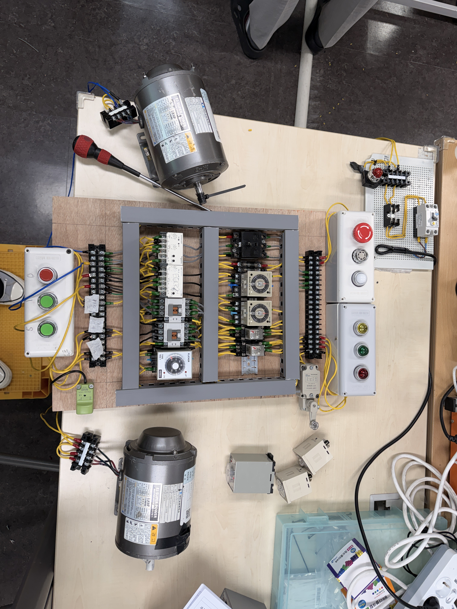

# "반도체장비 제어 전문가" 과정 – 시퀀스 제어회로 4종 설계·배선 및 이중 보호회로 최종평가 통과

## 개요
대한상공회의소 반도체장비 제어 전문가 과정에서 급수/배수, 컨베이어 자동화, 온도 제어, 이중 과부하 보호 등 서로 다른 제어 요구사항을 각각 회로로 구현하고, 이를 종합한 최종 시험을 통과한 프로젝트입니다.

- **기간**: [2026.04 ~ 2026.05]
- **참여 형태**: 개인 (자격 과정 실습 및 최종 평가)
- **담당 역할**: 도면 설계부터 실제 배선까지 전 과정 직접 수행

## 배경 및 문제 정의
자기유지회로, EOCR(과전류계전기), 플리커릴레이(FR), 플로트리스 릴레이(FLS), 카운터(CNT), 리미트스위치(LS), 온도릴레이(TC) 등 제어 기기의 특성을 각각 이해하고, 이를 조합해 자동/수동 겸용 시퀀스 회로를 도면 설계부터 실제 배선까지 직접 구현해야 하는 과제였습니다.

## 사용 기술 / 툴
- 제어 기기: 자기유지회로, EOCR(과전류계전기), 플리커릴레이(FR), 플로트리스 릴레이(FLS), 카운터(CNT), 리미트스위치(LS), 온도릴레이(TC), 타이머(T), 릴레이(X), 접촉기(MC)
- 작업 범위: 시퀀스 회로 도면 설계, 실제 배선(결선) 작업
- 설계 방식: 자동/수동 겸용 로직 설계

## 시스템 구성

| 구분 | 핵심 제어 기기 | 동작 로직 |
|---|---|---|
| 1. 급수 자동/수동 제어 | FLS, 타이머(T) | 자동: FLS 수위 감지 → MC1 자동 기동 / 수동: PB1+타이머 → MC1→MC2 순차 기동 |
| 2. 컨베이어 자동화 | 근접센서, 카운터(CNT) | 제품 통과 수 카운트 → 설정 수량 도달 시 IM1(컨베이어)→IM2(포장) 자동 전환 |
| 3. 온도 자동조절 | 온도릴레이(TC), 열전대 | 설정 온도 도달 시 순환모터 → 배기모터 자동 전환 |
| 4. 공통 보호회로 | EOCR, 플리커릴레이(FR) | 과전류 감지 시 안전 정지 + 부저·램프 점멸 경보 |
| 5. 최종평가 복합 시퀀스 (2026.05.08) | EOCR1/2, LS1/2, T1/2, X1/2, MC1/2 | LS1 ON 시 설정시간 간격 MC1+YL 점멸 반복 / LS2 ON 시 MC2+RL 점멸 반복 |

## 주요 구현 내용

### 1) 플로트리스 릴레이 기반 급수 자동/수동 제어
셀렉터(SS)로 자동(A)/수동(M)을 전환하도록 설계했습니다. 자동 모드에서는 FLS(플로트리스 릴레이)의 수위 감지로 MC1이 자동 기동되고, 수동 모드에서는 PB1과 타이머(T)를 이용해 MC1→MC2가 순차적으로 기동되도록 회로를 설계·배선했습니다.

### 2) 근접센서+카운터 기반 컨베이어벨트 자동화
근접센서로 제품 통과 수를 감지하고 카운터(CNT)로 계수해, 설정 수량에 도달하면 컨베이어 모터(IM1)에서 포장 모터(IM2)로 자동 전환되는 로직을 구현했습니다.

### 3) 온도계전기(TC) 기반 자동온도조절 장치
열전대로 온도를 감지하고, 설정 온도에 도달하면 순환모터에서 배기모터로 자동 전환되는 회로를 구성했습니다.

### 4) 공통 보호회로: EOCR 과전류 보호 + 플리커 경보
전 과제 공통으로 EOCR 과전류 보호회로와 플리커릴레이(FR) 기반 경보 회로(부저·램프 점멸)를 적용해, 이상 발생 시 안전 정지와 경보가 함께 동작하도록 설계했습니다.

### 5) 최종평가: 이중 보호회로 기반 복합 자동 시퀀스 (2026.05.08)
EOCR1/EOCR2 이중 과부하 보호, 리미트스위치 LS1/LS2, 타이머 T1/T2, 릴레이 X1/X2, 접촉기 MC1/MC2를 조합해 "LS1 ON 시 설정시간 간격으로 MC1+YL 점멸 반복, LS2 ON 시 MC2+RL 점멸 반복"하는 복합 자동 시퀀스 회로를 설계·배선했습니다.

  
  

  

## 결과 및 성과
- 급수·컨베이어·온도제어 등 4개 이상 실습 과제 회로 설계·배선 전 과제 정상 동작 확인
- 이중 EOCR 보호 + 리미트스위치 + 듀얼 타이머 복합 시퀀스로 구성된 최종 시험(2026.05.08) 통과
- 반도체장비 제어 전문가 과정 이수

## 회고 / 배운 점
계전기·타이머·카운터·센서 등 개별 제어 기기의 동작 원리를 정확히 이해해야 이를 조합한 복합 자동화 로직을 오류 없이 설계할 수 있다는 것을 체감했습니다. EOCR·인터록 등 보호회로를 항상 함께 설계하는 "안전 우선" 설계 습관을 체득했고, 도면 설계 능력과 실물 배선 능력을 동시에 갖춰야 현장 장비 트러블슈팅이 가능하다는 것을 확인했습니다.
