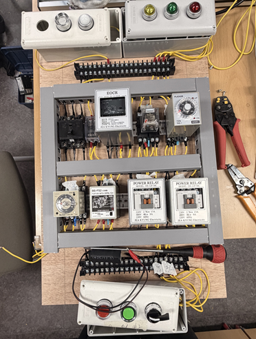
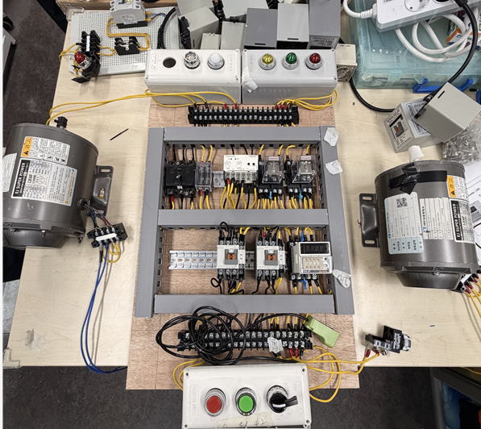
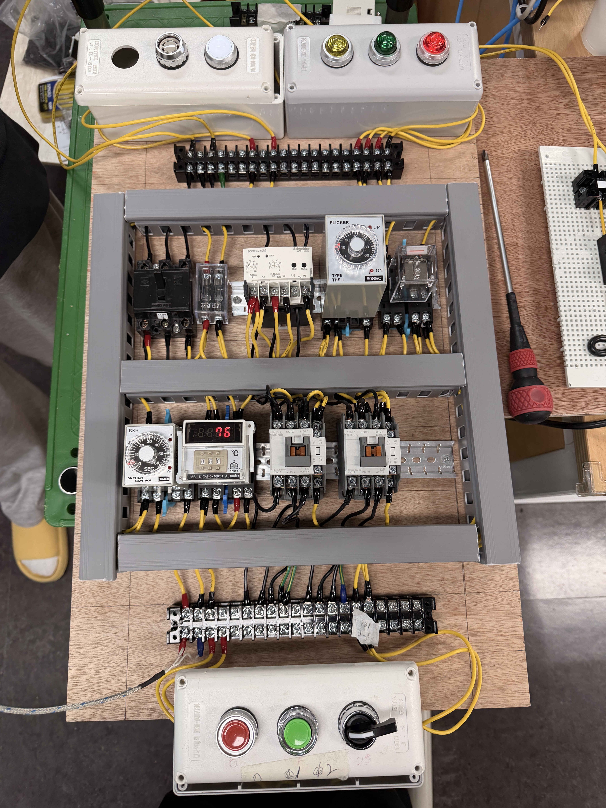
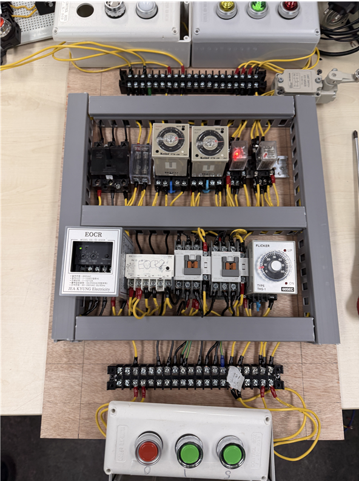
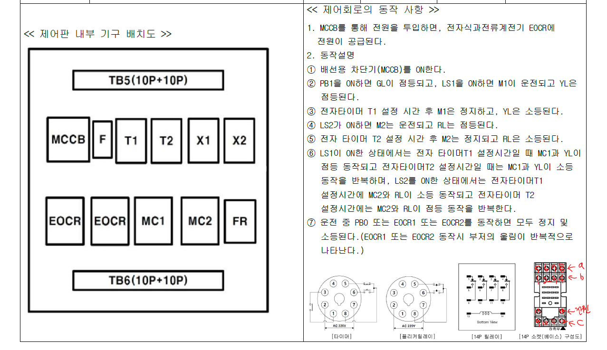
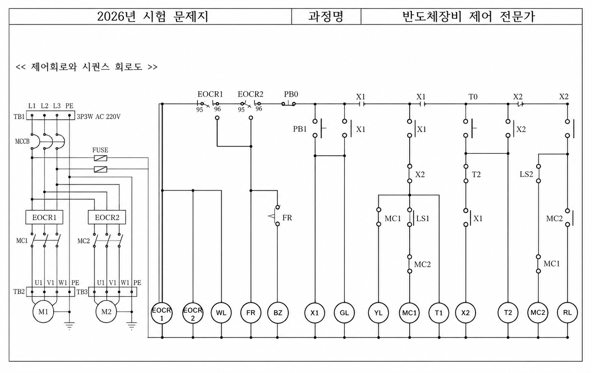
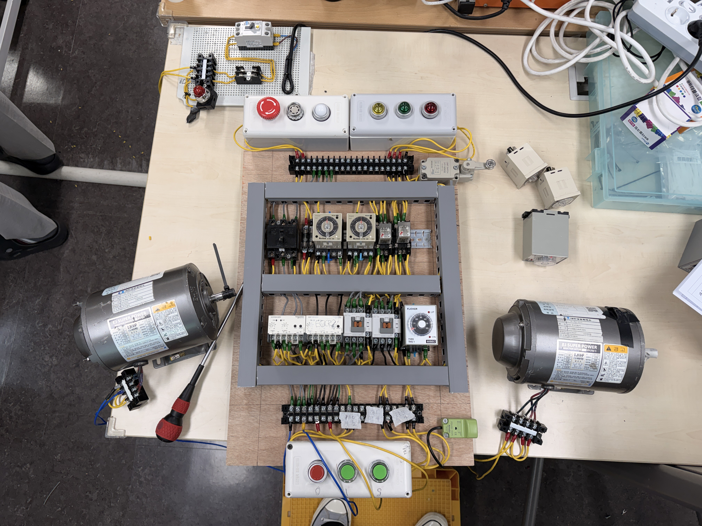

# 반도체장비 제어 전문가 과정 – 시퀀스 제어회로 4종 설계·배선

### 급수 · 컨베이어 · 온도제어 · 이중 과부하 보호 복합 시퀀스 구현

> **Relay · Timer · Counter · Sensor · EOCR 등 산업용 제어기기를 조합해
> 자동/수동 시퀀스 회로를 직접 설계·배선하고 복합 자동제어 최종평가를 통과한 프로젝트**

* **기간**: 2026.04 ~ 2026.05
* **참여 형태**: 개인 실습 및 최종평가
* **담당 역할**: 회로 설계 · 제어기기 결선 · 실제 배선 · 동작 검증 전 과정 직접 수행
* **주요 기술**: Sequence Control, Relay, Timer, Counter, FLS, EOCR, Limit Switch, Temperature Controller

---

## 시스템 구성

| 구분                 | 핵심 제어 기기                          | 구현 동작                                |
| ------------------ | --------------------------------- | ------------------------------------ |
| **급수 자동/수동 제어**    | FLS, Timer, MC                    | 수위 감지 기반 자동 급수 / Timer 기반 수동 순차 기동   |
| **Conveyor 자동화**   | 근접센서, Counter                     | 제품 수량 계수 후 Conveyor → 포장 공정 자동 전환    |
| **온도 자동조절**        | TC, Thermocouple                  | 설정 온도 도달 시 순환 Motor → 배기 Motor 자동 전환 |
| **공통 보호회로**        | EOCR, Flicker Relay, Fuse         | 과전류 발생 시 설비 정지 및 Lamp·Buzzer 경보      |
| **최종 복합 Sequence** | EOCR1/2, LS1/2, T1/2, X1/2, MC1/2 | Limit Switch 입력에 따른 Motor·Lamp 반복 동작 |

---

<details>
<summary><b>01. 프로젝트 개요 및 문제 정의</b></summary>

<br>

대한상공회의소 **반도체장비 제어 전문가 과정**에서 산업 현장에서 사용하는 Relay, Timer, Counter, Sensor 및 보호기기의 동작 원리를 학습하고, 이를 조합한 자동화 Sequence 회로를 직접 설계·배선했습니다.

단순히 주어진 선을 따라 결선하는 것이 아니라 각 기기의

* Coil 동작
* NO / NC Contact 전환
* Timer Delay
* Counter 계수
* Sensor 입력
* Motor 출력
* 과전류 보호

관계를 이해한 뒤 실제 요구조건에 맞는 Sequence를 구성하는 것이 주요 과제였습니다.

프로젝트에서는 급수, Conveyor, 온도조절 등 서로 다른 자동제어 요구사항을 각각 회로로 구현했고, 모든 회로에는 EOCR과 Fuse 등 **Protection Circuit을 함께 적용해 이상 상황에서 안전하게 정지하도록 설계**했습니다.

최종평가에서는 앞선 실습 내용을 종합해 **EOCR 2개, Limit Switch 2개, Timer 2개, Relay, Magnetic Contactor를 결합한 복합 자동 Sequence**를 직접 설계·결선했습니다.

</details>

---

<details>
<summary><b>02. 사용 기술 / 제어 기기</b></summary>

<br>

| 구분          | 제어 기기                            | 역할                         |
| ----------- | -------------------------------- | -------------------------- |
| Relay Logic | Relay(X), Magnetic Contactor(MC) | 조건 Logic 및 Motor 출력 제어     |
| 유지회로        | 자기유지회로                           | 입력 해제 후에도 운전 상태 유지         |
| Timer       | T                                | 설정 시간 이후 출력 및 Sequence 전환  |
| Counter     | CNT                              | Sensor 입력 횟수 계수            |
| 수위제어        | FLS                              | 수위 검출 및 급수 Motor 자동 제어     |
| 온도제어        | TC, Thermocouple                 | 온도 측정 및 설정값 비교             |
| 위치검출        | Limit Switch                     | 설비 위치 및 동작 완료 감지           |
| 물체검출        | Proximity Sensor                 | 제품 통과 감지                   |
| 과전류 보호      | EOCR                             | Motor Over Current 감지 및 차단 |
| 경보          | Flicker Relay                    | Lamp / Buzzer 반복 점멸        |
| 회로 보호       | Fuse                             | 이상 전류 발생 시 제어회로 보호         |

### 작업 범위

`요구사항 분석 → Sequence 설계 → 회로도 작성 → 실제 결선 → 동작 검증 → 배선 Troubleshooting`

</details>

---

<details>
<summary><b>03. 주요 구현 내용</b></summary>

<br>

<details>
<summary><b>3-1. FLS 기반 급수 자동 / 수동 제어</b></summary>

<br>

Selector Switch를 이용해 **AUTO / MANUAL Mode를 선택할 수 있는 급수 제어회로**를 설계했습니다.

자동 Mode에서는 FLS(Floatless Level Switch)가 수위를 감지하고, 설정된 수위 조건에 따라 MC1이 자동으로 동작하도록 구성했습니다.

수동 Mode에서는 Push Button과 Timer를 이용해 작업자가 운전을 시작하면 **MC1 → MC2가 일정 시간 간격으로 순차 기동**하도록 설계했습니다.

#### 제어 흐름

```text
AUTO Mode

FLS 수위 감지
      ↓
수위 조건 판정
      ↓
MC1 자동 기동
```

```text
MANUAL Mode

PB1 입력
   ↓
MC1 기동
   ↓
Timer 동작
   ↓
MC2 순차 기동
```

<!-- 급수 자동/수동 제어 회로 사진 -->

<p align="center">
  
</p>

</details>

<br>

<details>
<summary><b>3-2. Proximity Sensor + Counter 기반 Conveyor 자동화</b></summary>

<br>

근접센서로 Conveyor를 통과하는 제품을 감지하고 **Counter(CNT)를 이용해 통과 수량을 계수하는 자동화 회로**를 구현했습니다.

설정 수량에 도달하기 전에는 Conveyor Motor인 IM1이 동작하며, Counter가 목표 수량에 도달하면 IM1의 동작을 종료하고 **포장 공정용 IM2로 자동 전환**되도록 Sequence를 구성했습니다.

#### 제어 흐름

```text
제품 진입
   ↓
근접센서 감지
   ↓
Counter +1
   ↓
설정 수량 비교
   ↓
IM1 정지
   ↓
IM2 자동 기동
```

Sensor 입력을 단순 ON/OFF 신호로 사용하는 것이 아니라 **제품 수량이라는 공정 조건으로 변환해 다음 Sequence를 제어**하도록 구현했습니다.

<!-- Conveyor 자동화 회로 사진 -->

<p align="center">
  
</p>

</details>

<br>

<details>
<summary><b>3-3. Temperature Controller 기반 자동 온도조절</b></summary>

<br>

Thermocouple로 현재 온도를 감지하고 Temperature Controller의 설정값과 비교해 Motor 동작을 자동으로 전환하는 회로를 구성했습니다.

정상 온도 구간에서는 순환 Motor를 운전하고, 설정 온도에 도달하면 Contact 상태가 전환되며 **순환 Motor → 배기 Motor**로 자동 변경되도록 설계했습니다.

#### 제어 흐름

```text
Thermocouple
      ↓
현재 온도 측정
      ↓
TC 설정값 비교
      ↓
설정 온도 미만
→ 순환 Motor

설정 온도 도달
→ 배기 Motor
```

이를 통해 작업자의 수동 조작 없이 **온도 입력값을 기준으로 출력 장치가 자동 전환되는 Feedback Sequence**를 구현했습니다.

<!-- 온도 자동조절 회로 사진 -->

<p align="center">
  
</p>

</details>

<br>

<details>
<summary><b>3-4. EOCR + Flicker Relay 기반 보호 및 경보회로</b></summary>

<br>

각 실습 회로에는 정상 운전 Logic뿐 아니라 **과전류 발생 시 Motor를 차단하는 EOCR 보호회로**를 함께 적용했습니다.

EOCR이 이상 전류를 감지하면 Magnetic Contactor의 운전 회로가 차단되어 Motor가 정지하고, Flicker Relay를 통해 **Lamp와 Buzzer가 반복적으로 동작하도록 경보회로**를 구성했습니다.

#### 보호 흐름

```text
Over Current 발생
       ↓
EOCR 동작
       ↓
MC 출력 차단
       ↓
Motor 정지
       ↓
Flicker Relay
       ↓
Lamp + Buzzer 경보
```

정상 운전 조건보다 **Protection Contact가 우선하도록 회로에 포함**해 이상 발생 시 설비가 계속 운전되지 않도록 설계했습니다.

또한 제어회로 전원 입력부에는 Fuse를 적용하고, 단순히 지정된 단자를 따라 연결하는 것이 아니라 **전원 신호가 어느 방향으로 들어오고 Fuse를 거친 뒤 어떤 제어회로로 전달되어야 하는지 직접 판단해 배선**했습니다.

#### 제어회로 전원 흐름

```text
Power Input
    ↓
   Fuse
    ↓
Protection Circuit
    ↓
Relay / Timer / Sensor
    ↓
MC / Output
```

전체 회로의 **전원 → 보호회로 → 제어회로 → 출력**으로 이어지는 전류 흐름을 기준으로 Fuse의 입·출력 방향과 다음 연결 지점을 구성했습니다.

이를 통해 정상 운전 Sequence뿐 아니라 **과전류 및 이상 상황을 고려한 보호회로와 전체 전원 흐름을 함께 이해하며 Wiring을 구성하는 경험**을 쌓았습니다.

<!-- EOCR + Flicker Relay 회로 사진 -->

<p align="center">
  
</p>

</details>

<br>

<details>
<summary><b>3-5. 최종평가 – 이중 EOCR 기반 복합 자동 Sequence</b></summary>

<br>

**2026.05.08** 최종평가에서는 앞선 실습에서 사용한 여러 제어기기를 종합해 복합 Sequence 회로를 직접 설계·배선했습니다.

#### 사용 기기

* EOCR1 / EOCR2
* Limit Switch LS1 / LS2
* Timer T1 / T2
* Relay X1 / X2
* Magnetic Contactor MC1 / MC2
* Yellow Lamp / Red Lamp

#### 동작 조건 1

```text
LS1 ON
   ↓
Timer Sequence
   ↓
MC1 + Yellow Lamp
   ↓
설정 시간 간격 반복 동작
```

#### 동작 조건 2

```text
LS2 ON
   ↓
Timer Sequence
   ↓
MC2 + Red Lamp
   ↓
설정 시간 간격 반복 동작
```

두 Motor 회로에는 각각 EOCR을 적용해 **이중 Overload Protection**을 구성했습니다.

또한 Limit Switch 입력과 Timer·Relay Contact를 조합해 각각의 출력이 설정된 시간 간격으로 반복 동작하도록 Sequence를 구현했습니다.

#### 회로 설계

<p align="center">
  
  
</p>

#### 실제 결선

<p align="center">
  
</p>

</details>

</details>

---

<details>
<summary><b>04. 트러블슈팅 ⭐</b></summary>

<br>

<details>
<summary><b>Trouble 01. Timer 동작 후 Reset되지 않는 문제</b></summary>

<br>

#### Problem

Timer를 사용하는 Sequence를 실제 배선한 뒤 반복 동작을 확인하는 과정에서, 한 번 동작한 Timer가 **정상적으로 Reset되지 않아 다음 Sequence가 이어지지 않는 문제**가 발생했습니다.

#### Analysis

Timer 설정값이나 부품 자체의 이상보다는 **Reset 신호가 실제 Timer까지 전달되고 있는지**를 먼저 확인했습니다.

회로도와 실제 결선을 비교하면서 Timer의 Pin 번호와 각 Pin의 기능을 다시 확인했고, Reset 동작을 담당하는 Pin까지 배선을 하나씩 추적했습니다.

그 결과 **Reset 신호가 입력되어야 하는 Timer Pin에 배선 자체가 연결되지 않은 상태**임을 확인했습니다.

```text
Reset 조건 발생
      ↓
Relay Contact
      ↓
Timer Reset Pin
      ↓
[배선 누락]
```

#### Solution

Timer의 Pin Diagram을 다시 확인한 뒤 누락된 Reset 신호 배선을 추가했습니다.

이후 Timer를 반복 동작시키며

`Timer 동작 → 설정시간 완료 → Reset → 다음 Sequence`

가 정상적으로 반복되는지 검증했습니다.

#### Result

Timer가 매 Cycle마다 정상적으로 Reset되면서 이후 Sequence도 연속적으로 동작하는 것을 확인했습니다.

> **Learned**
> 제어기가 예상대로 동작하지 않을 때 부품 자체를 먼저 의심하는 것이 아니라, **조건 신호가 실제 어느 Pin까지 전달되는지를 회로도와 실제 Wiring을 비교하며 추적하는 것이 중요하다는 점**을 배웠습니다.

</details>

<br>

<details>
<summary><b>Trouble 02. Start 입력에도 회로가 기동하지 않는 문제</b></summary>

<br>

#### Problem

Sequence 회로의 배선을 완료한 뒤 Start 입력을 주었지만 **Relay와 출력회로가 동작하지 않아 전체 Sequence가 시작되지 않는 문제**가 발생했습니다.

#### Analysis

Start 입력부터 신호가 전달되는 경로를 하나씩 확인하면서 Relay 및 제어기기의 Pin을 다시 점검했습니다.

확인 결과, 부품의 **Pin 번호 배열과 실제 Contact 구조를 혼동해 배선한 것**이 원인이었습니다.

해당 부품은 공통단자인 **C를 기준으로 A 또는 B 접점과 연결되어야 신호가 전달되는 구조**였지만, 초기 결선에서는 각 단자의 기능보다 물리적인 Pin 배열을 기준으로

```text
C → A → B → D
```

형태로 연결했습니다.

즉, Pin의 위치를 순서대로 연결했지만 실제 내부 Contact에서는 C와 A 또는 C와 B 사이가 하나의 신호 경로를 구성해야 하므로 회로가 성립하지 않았습니다.

#### Solution

부품의 Pin Diagram을 다시 확인하며

* Common Pin이 어느 단자인지
* NO / NC Contact가 어느 Pin인지
* 입력 상태에 따라 C가 A와 연결되는지 B와 연결되는지
* 다음 제어기로 전달할 신호를 어느 Pin에서 꺼내야 하는지

를 다시 정리했습니다.

이후 Pin의 위치가 아니라 **실제 Contact 동작 원리를 기준으로 회로를 재배선**했습니다.

#### Result

Pin 기능에 맞게 결선한 이후 Start 입력 시 Relay가 정상 동작했고, 전체 Sequence가 의도한 순서대로 시작되는 것을 확인했습니다.

> **Learned**
> 제어회로 배선에서는 단순히 Pin 번호나 배치 순서를 외우는 것이 아니라 **Common Contact를 기준으로 입력 신호가 어느 접점을 통해 출력으로 전달되는지 이해한 상태에서 결선해야 한다는 점**을 체감했습니다.

</details>

</details>

---

<details>
<summary><b>05. 결과 및 성과</b></summary>

<br>

* **급수 · Conveyor · 온도제어 · Protection 등 4종 이상의 Sequence 회로 직접 설계·배선**
* FLS 기반 **급수 AUTO / MANUAL 제어 구현**
* Proximity Sensor + Counter 기반 **제품 수량별 Conveyor 자동 전환 구현**
* Temperature Controller 기반 **자동 온도조절 Sequence 구현**
* EOCR + Flicker Relay 기반 **Motor Over Current Protection 및 Alarm 구현**
* Fuse 입·출력 신호 흐름을 직접 판단해 **제어회로 전원 및 보호 경로 구성**
* Relay · Timer · Counter · Limit Switch 등 다양한 산업용 제어기기의 **Pin 및 Contact 동작 원리 이해**
* Timer Reset 미동작 및 Start 불가 문제를 **Pin 단위 신호 추적으로 진단·해결**
* **EOCR1/2 · LS1/2 · T1/2 · Relay · MC 기반 복합 Sequence 최종평가 통과**
* 회로 설계부터 실제 결선 및 동작 검증까지 전 과정 수행
* **반도체장비 제어 전문가 과정 이수**

</details>

---

<details>
<summary><b>06. 회고 / 배운 점</b></summary>

<br>

이번 과정을 통해 Relay, Timer, Counter, Sensor와 같은 개별 제어기기의 기능을 이해하는 것과 **여러 기기를 실제 Sequence로 연결하는 것은 다른 문제**라는 점을 체감했습니다.

특히 Timer Reset이 되지 않거나 Start 신호를 입력해도 회로가 시작되지 않는 문제를 해결하면서, 단순히 도면이 맞는지만 확인하는 것이 아니라 **입력 신호가 실제 배선을 따라 어느 Pin까지 전달되고 있는지를 직접 추적하는 방법**을 익혔습니다.

처음에는 일부 제어기의 Pin을 물리적인 배열 순서 위주로 이해했지만, 실제 Troubleshooting 과정에서 Common Contact와 NO / NC Contact 사이의 전기적 관계를 다시 확인하며 **Pin 번호보다 내부 접점의 동작 원리를 이해하는 것이 중요하다는 점**을 배웠습니다.

또한 Fuse, EOCR과 같은 Protection Device를 배선하면서 정상 운전 신호만 연결하는 것이 아니라 **전원이 어떤 보호기기를 거쳐 어느 제어회로로 전달되어야 하는지 전체 전류 흐름을 기준으로 회로를 바라보는 습관**을 익혔습니다.

이를 통해 회로 설계 능력뿐 아니라 실제 Wiring 과정에서 발생하는 문제를 **회로도 → Pin → Contact → 실제 배선 → 출력 상태 순으로 추적하는 현장형 Troubleshooting 경험**을 쌓았습니다.

</details>
