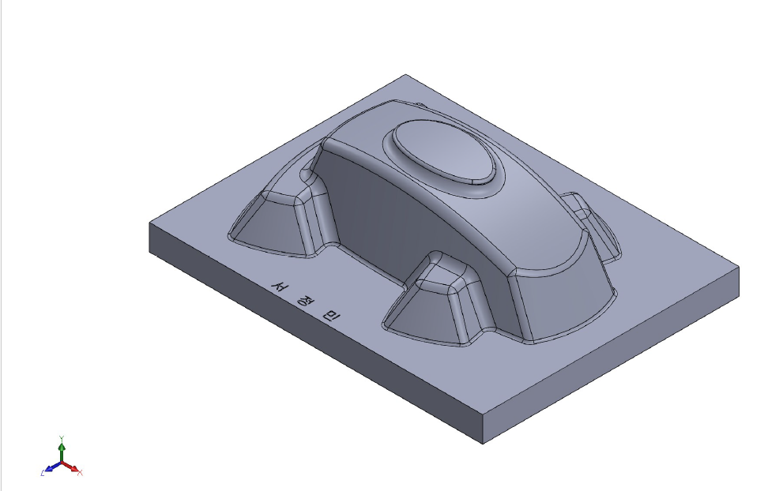
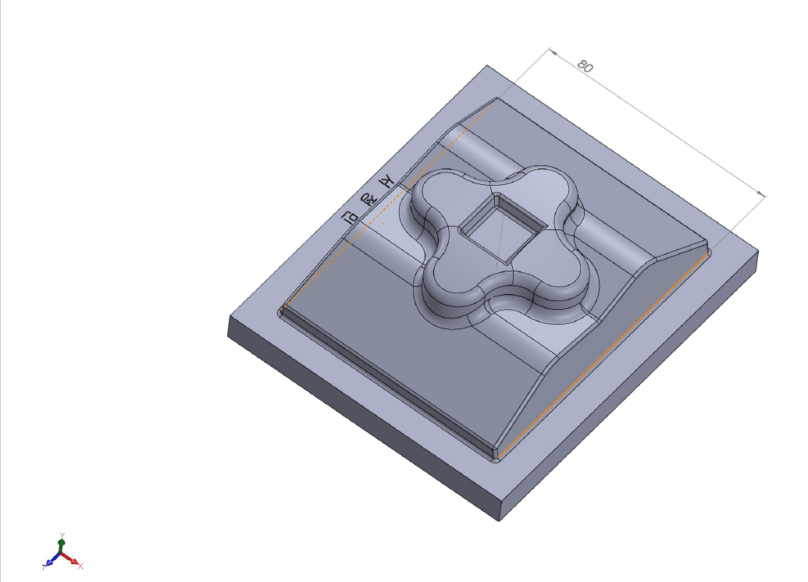
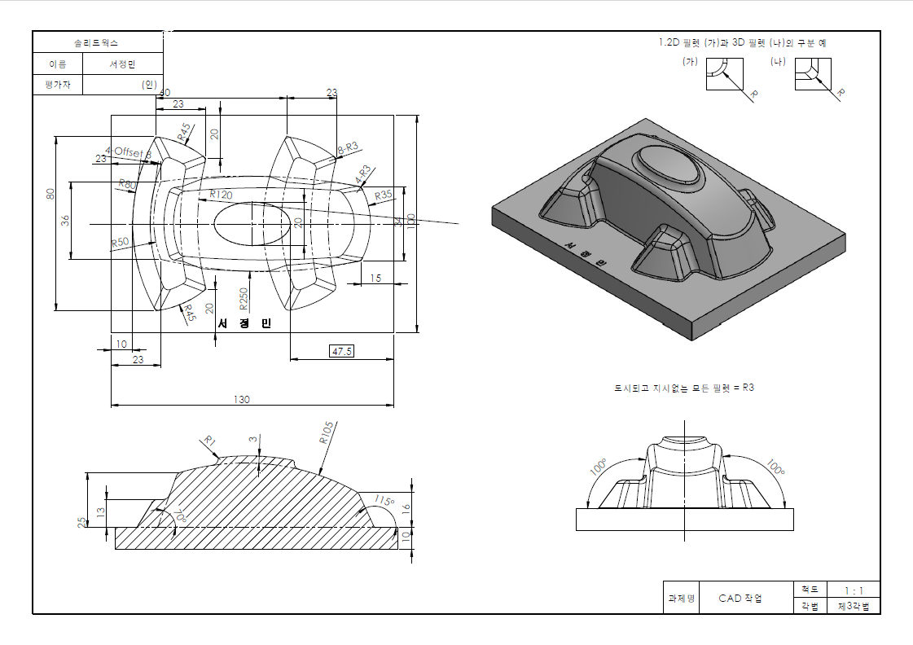
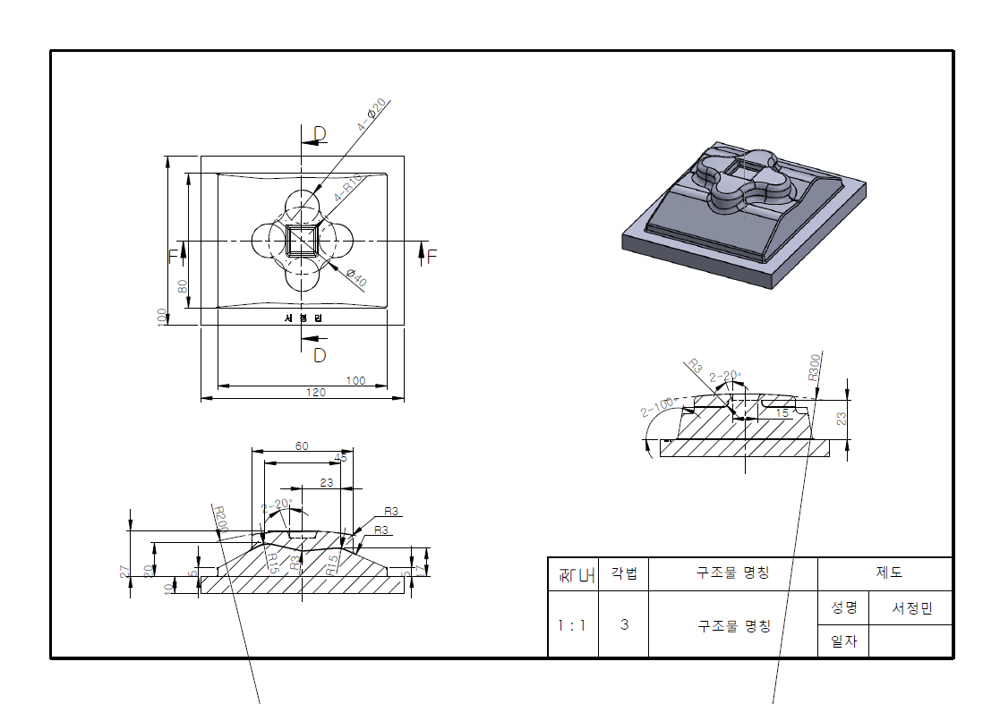
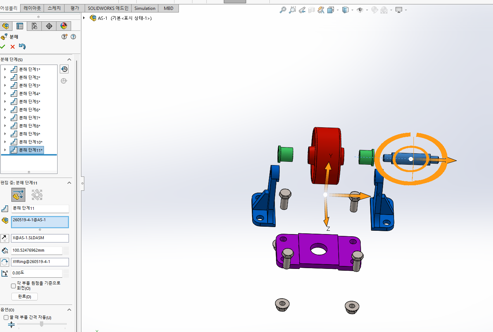
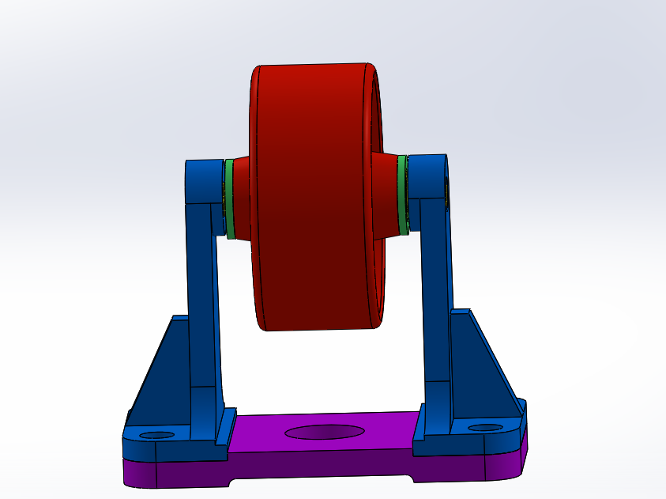

# SolidWorks 역설계 모델링 · 제3각법 도면화 및 조립 설계

### 복합 Fillet 하우징 역설계 + Roller / Caster 지지 구조물 Assembly

> **완성 도면과 3D 참조 이미지를 분석해 복합 곡면 부품을 역설계하고,
> 제3각법 도면화 · 3D Printing 검증 · 다부품 Assembly 및 Exploded View까지 수행한 3D CAD 프로젝트**

* **기간**: 2026.05.12 ~ 2026.05.27
* **참여 형태**: 개인 프로젝트
* **담당 역할**: 도면 해석 · 형상 분석 · Part Modeling · Assembly · 2D Drawing · 3D Printing 검증 전 과정 수행
* **주요 기술**: SolidWorks, Sketch, Extrude, Fillet, Chamfer, Shell, Pattern, Mate, Exploded View, Third-angle Projection, 3D Printing

---

## 작업 프로세스

```text
참조 도면 / 3D 이미지 분석
        ↓
형상 Feature 분해
        ↓
Sketch / Extrude
        ↓
Fillet / Chamfer / Shell
        ↓
3D Part Modeling
        ↓
제3각법 2D Drawing
        ↓
3D Printing
        ↓
도면 - Model - 실물 검증
```

### Assembly Process

```text
완성 조립체 이미지 분석
        ↓
구성 Part 분리
        ↓
부품별 개별 Modeling
        ↓
SolidWorks Assembly
        ↓
Mate 구속조건 적용
        ↓
조립 상태 검증
        ↓
Exploded View 작성
```

---

<details>
<summary><b>01. 프로젝트 개요 및 문제 정의</b></summary>

<br>

3D 설계 수업에서 완성된 도면과 3D 참조 이미지만을 바탕으로 **하우징형 부품 2종을 역설계하고 동일한 형상으로 재현하는 과제**를 수행했습니다.

일반적인 따라하기 방식과 달리 Modeling 과정이나 Feature 생성 순서가 제공되지 않아, 완성 형상을 직접 분석한 뒤

`어떤 Sketch → Extrude → Fillet → Chamfer → Shell 순서로 구성해야 하는지`

를 스스로 판단해야 했습니다.

첫 번째 부품은 타원형 Dome 형태를 기반으로 다수의 Fillet과 서로 다른 경사각이 적용된 복합 Housing 구조였고, 두 번째 부품은 4방향 대칭 Clover 형상과 Hole · Circular Seat · 복합 Fillet이 결합된 구조였습니다.

특히 **R1 ~ R300 범위의 다양한 Fillet, 2D / 3D Fillet 구분, 20° ~ 115°의 경사각 및 대칭 구조**를 도면과 3D Reference를 함께 보며 해석해야 했습니다.

Modeling 완료 후에는 두 부품을 **제3각법 기준 2D Drawing으로 변환하고 치수 · Radius · Angle을 직접 기입**했습니다.

이후 3D Printing으로 실물을 출력해 도면과 3D Model의 형상 정합성을 확인했습니다.

별도 Assembly 과제에서는 완성된 Roller / Caster 지지 구조 이미지만을 보고 구성 Part를 역으로 분석해

* Wheel
* Support Arm
* Base Plate
* Bushing
* Bolt류

를 모두 개별 Modeling한 뒤 SolidWorks Assembly에서 조립하고 Exploded View까지 작성했습니다.

</details>

---

<details>
<summary><b>02. 사용 기술 / 툴</b></summary>

<br>

| 구분               | 기술 / 기능                  | 활용 내용                           |
| ---------------- | ------------------------ | ------------------------------- |
| 3D CAD           | SolidWorks               | Part Modeling 및 Assembly        |
| Sketch           | Line, Circle, Constraint | 기본 Profile 및 대칭 구조 작성           |
| Feature          | Extrude                  | 기본 Body 및 Boss 생성               |
| Surface Detail   | Fillet                   | R1 ~ R300 복합 곡면 구현              |
| Edge Detail      | Chamfer                  | 20° ~ 115° 경사 형상 구현             |
| Hollow Structure | Shell                    | Housing 내부 두께 및 중공 구조 구현        |
| Repetition       | Pattern / Symmetry       | 4방향 대칭 구조 구현                    |
| Assembly         | Mate                     | Concentric · Coincident 등 구속 적용 |
| Assembly 표현      | Exploded View            | 조립 구조 및 결합 순서 표현                |
| Drawing          | Third-angle Projection   | 정면 · 평면 · 측면도 작성                |
| 검증               | 3D Printing              | CAD Model 실물 형상 검증              |

</details>

---

<details>
<summary><b>03. 주요 구현 내용</b></summary>

<br>

### 3-1. 타원형 Dome Housing 역설계

완성 도면과 3D Reference를 분석해 타원형 Dome 구조를 갖는 첫 번째 Housing 부품을 역설계했습니다.

Modeling Sequence가 제공되지 않았기 때문에 최종 형상을

* 기본 Body
* 내부 Shell
* 경사면
* Edge Fillet
* Corner Fillet
* Offset 형상

으로 나누고 **Feature 생성 순서를 직접 설계**했습니다.

#### 주요 형상 조건

* `8-R3`
* `4-R3`
* `R35 ~ R250` 복합 Fillet
* `100° / 115° / 70°` 경사각
* `4-Offset 8`
* 2D Fillet / 3D Fillet 구분 적용

특히 도면에 동일하게 `R`로 표시되어 있더라도 Sketch Profile 자체의 곡률을 만드는 Fillet과 Solid 생성 이후 Edge에 적용되는 Fillet을 구분해 적용했습니다.

<p align="center">
  
</p>

---

### 3-2. 4엽 Clover Housing 역설계

두 번째 부품은 중심을 기준으로 4방향 대칭 구조를 갖는 Clover형 Housing으로, 반복되는 형상을 하나씩 개별 Modeling하지 않고 **대칭 구속과 Pattern 기능을 활용해 형상 일관성을 유지**했습니다.

#### 주요 형상 조건

* 4방향 대칭 Clover Boss
* `Ø20` Hole × 4
* `Ø40` Circular Seat
* `R3 ~ R300` 복합 Fillet
* `20° / 100°` Chamfer
* Symmetry Constraint 및 Pattern 활용

먼저 중심축과 기준 형상을 설정한 뒤 반복 Feature를 적용해 전체 구조를 만들고, 이후 Hole · Fillet · Chamfer 등 세부 형상을 추가했습니다.

<p align="center">
  
</p>

---

### 3-3. 제3각법 기반 2D Drawing 작성

완성한 두 Part Model을 SolidWorks Drawing 환경으로 가져와 **제3각법(Third-angle Projection) 기준 2D 도면**으로 변환했습니다.

단순 View 배치에 그치지 않고 실제 형상을 재현할 수 있도록

* 전체 치수
* Hole 직경
* Fillet Radius
* Offset
* 경사각
* 형상 위치

등을 직접 기입했습니다.

도면은 **Scale 1:1** 기준으로 작성했습니다.

<p align="center">
  
  
</p>

이를 통해 3D Model을 만드는 것뿐 아니라 **제작자가 도면만 보고 형상과 치수를 이해할 수 있도록 표현하는 Drawing 작성 경험**을 함께 쌓았습니다.

---

### 3-4. 3D Printing 기반 실물 검증

완성한 CAD Model을 3D Printer로 출력해 화면상의 형상이 실제 물체에서도 의도한 형태로 구현되는지 확인했습니다.

```text
2D Drawing
    ↓
3D CAD Model
    ↓
3D Printing
    ↓
실물 형상 확인
```

출력물을 통해

* 전체 외형
* 곡면 연결
* Fillet 형상
* Hole 위치
* 주요 비율
* 도면과 Model의 정합성

을 확인했습니다.

이를 통해 CAD 작업을 화면상의 Modeling에서 끝내지 않고 **Drawing → Model → 실물로 이어지는 제작 관점에서 검증**했습니다.

---

### 3-5. Roller / Caster 지지 구조물 Part Modeling

별도 Assembly 과제에서는 완성된 Roller / Caster 지지 구조물 이미지만을 보고 조립체를 구성하는 Part를 역으로 분석했습니다.

#### 직접 Modeling한 부품

* Base Plate
* Support Arm 1
* Support Arm 2
* Wheel / Roller
* Bushing × 2
* Bolt류

완성된 조립체의 외형만 보고 각 Part가 어떤 형상과 결합 구조를 가져야 하는지 추론한 뒤 개별적으로 Modeling했습니다.

---

### 3-6. Assembly 및 Mate 구속조건 적용

완성한 Part를 SolidWorks Assembly 환경으로 불러와 실제 구조와 동일하게 조립했습니다.

부품 간 결합 관계에 따라

* **Concentric Mate**
* **Coincident Mate**
* 위치 및 방향 구속

을 적용해 Wheel · Bushing · Support Arm · Base Plate가 의도한 위치에 조립되도록 구성했습니다.

<p align="center">
  
</p>

Assembly 과정에서는 Part를 단순히 원하는 위치로 이동시키는 것이 아니라 **어느 면과 축을 기준으로 다른 부품과 결합되는지를 먼저 판단한 뒤 Mate를 적용**했습니다.

---

### 3-7. Exploded View 작성

완성된 Assembly의 부품 구성과 조립 순서를 쉽게 파악할 수 있도록 **Exploded View**를 작성했습니다.

<p align="center">
  
</p>

각 Part가 실제 조립 방향에 맞게 분리되도록 이동 방향과 순서를 설정해 **조립체의 구조와 부품 간 결합 관계를 한눈에 확인할 수 있도록 표현**했습니다.

</details>

---

<details>
<summary><b>04. 트러블슈팅 ⭐</b></summary>

<br>

### Trouble 01. 복합 Fillet이 원하는 방향으로 생성되지 않거나 Feature Error가 발생하는 문제

#### Problem

Housing의 복합 곡면을 재현하기 위해 도면에 표시된 Radius 값을 기준으로 Fillet을 적용했지만, **의도한 방향과 다른 곡면이 생성되거나 일부 Edge에서 Feature 생성이 실패하는 문제**가 발생했습니다.

특히 여러 곡면과 경사면이 만나는 영역에서는 같은 Radius 값을 사용해도 참조 이미지와 다른 형상이 만들어졌습니다.

#### Analysis

처음에는 도면의 Radius 값만 동일하게 입력하면 같은 형상이 만들어질 것이라고 생각했습니다.

하지만 실제 Modeling 결과를 비교하면서 Fillet 형상은

* 선택한 Edge
* 인접한 면의 형상
* 앞에서 생성된 Feature
* Fillet 적용 시점

에 따라 달라진다는 점을 확인했습니다.

따라서 단순히 Radius 값을 변경하는 것이 아니라 **어느 Edge와 면 사이에 곡면이 형성되어야 하는지**를 3D Reference와 비교하며 분석했습니다.

#### Solution

Fillet을 한 번에 적용하지 않고

1. 기준 Body 형상 확인
2. 대상 Edge 재선택
3. Reference와 곡면 방향 비교
4. 큰 곡률과 작은 곡률을 단계적으로 적용
5. Feature 적용 후 매 단계 형상 확인

방식으로 Modeling했습니다.

또한 필요한 부분에서는 Sketch 단계에서 곡률을 만드는 **2D Fillet**과 Solid 이후 Edge를 가공하는 **3D Fillet**을 구분해 적용했습니다.

#### Result

참조 이미지와 곡면 연결 방향을 반복 비교하며 Fillet 적용 위치를 수정해 원하는 Housing 형상을 재현했습니다.

> **Learned**
> Fillet은 단순히 Radius 값을 입력하는 기능이 아니라 **주변 면과 Edge, 이전 Feature와의 관계에 따라 결과가 달라지는 Feature**라는 점을 배웠습니다.

---

### Trouble 02. Fillet 적용 순서에 따라 최종 형상이 달라지는 문제

#### Problem

여러 Radius의 Fillet이 중첩되는 Housing에서 각각의 치수는 도면과 동일했지만, **Fillet을 적용하는 순서에 따라 최종 형상이 참조 모델과 다르게 만들어지는 문제**가 발생했습니다.

앞에서 적용한 Fillet이 다음 Feature에서 사용할 Edge 형상을 변경하면서 이후 Fillet이 정상적으로 적용되지 않는 경우도 있었습니다.

#### Analysis

SolidWorks Feature는 서로 독립적으로 존재하는 것이 아니라 앞 단계의 결과를 기준으로 다음 Feature가 생성된다는 점을 확인했습니다.

예를 들어,

```text
Base Feature
     ↓
Fillet A
     ↓
Edge 형상 변경
     ↓
Fillet B
```

와

```text
Base Feature
     ↓
Fillet B
     ↓
Edge 형상 변경
     ↓
Fillet A
```

는 같은 Radius 값을 사용하더라도 서로 다른 결과가 나타날 수 있었습니다.

Feature Tree를 단계별로 확인하면서 **어떤 Fillet이 이후 Feature의 기준 Edge에 영향을 주는지**를 분석했습니다.

#### Solution

전체 형상을 결정하는 Feature와 세부 마감 Feature를 구분해 순서를 다시 구성했습니다.

* 기본 Body 형상
* 전체 외형을 결정하는 큰 곡률
* 주요 연결부 Fillet
* Corner / Edge의 작은 Fillet
* 세부 마감 Feature

순으로 Feature Tree를 재배치했습니다.

필요한 경우 기존 Feature를 Suppress한 뒤 순서를 변경하고 Reference와 비교하면서 가장 안정적으로 형상이 생성되는 Sequence를 찾았습니다.

#### Result

Fillet 생성 순서를 재구성해 복합 곡면이 참조 형상과 동일한 방향으로 연결되도록 Modeling했습니다.

> **Learned**
> CAD에서는 개별 Feature의 치수뿐 아니라 **Feature Tree의 생성 순서 자체가 최종 설계 결과를 결정한다는 점**을 체감했습니다.

---

### Trouble 03. Shell 적용 후 두께와 곡면이 깨지는 문제

#### Problem

Housing 내부를 비우기 위해 Shell 기능을 적용하는 과정에서 **일부 곡면이 정상적으로 생성되지 않거나 원하는 두께로 내부 형상이 만들어지지 않는 문제**가 발생했습니다.

특히 복잡한 Fillet을 먼저 적용한 상태에서는 Shell Feature가 실패하거나 내부 Offset 형상이 깨지는 경우가 있었습니다.

#### Analysis

Shell은 외곽 형상을 기준으로 일정 두께만큼 내부에 Offset Surface를 생성하기 때문에, 복잡한 곡률과 작은 Fillet이 먼저 존재하면 내부 면끼리 간섭할 수 있다고 판단했습니다.

Feature Tree를 이전 단계로 되돌려 확인한 결과 **Shell을 적용하는 시점과 Fillet의 생성 순서가 내부 형상 생성에 영향을 주는 것**을 확인했습니다.

#### Solution

Modeling Sequence를

```text
기본 Body
   ↓
주요 외형 형성
   ↓
Shell
   ↓
세부 Fillet / Chamfer
```

순으로 재구성했습니다.

Shell 적용에 영향을 많이 주는 작은 Fillet과 세부 Feature는 뒤쪽 단계로 이동시키고, Shell 적용 직후 내부 곡면과 두께가 정상적으로 형성되는지 확인했습니다.

#### Result

Feature 적용 순서를 조정해 Housing의 외곽 곡면을 유지하면서 내부 두께도 정상적으로 생성되도록 Modeling했습니다.

> **Learned**
> Shell과 같이 기존 형상을 기준으로 새로운 면을 생성하는 Feature는 **앞선 Feature의 영향을 크게 받기 때문에 적용 시점까지 고려해 Modeling Sequence를 설계해야 한다는 점**을 배웠습니다.

---

### Trouble 04. 도면 치수만으로 3D 형상이 해석되지 않는 문제

#### Problem

완성 도면에는 주요 치수와 Radius, Angle이 표시되어 있었지만 일부 곡면과 연결부는 **2D 도면의 치수만으로 실제 3D 형상이 어느 방향으로 이어지는지 정확하게 판단하기 어려웠습니다.**

특히 여러 Fillet이 만나는 영역에서는 같은 치수를 사용하더라도 서로 다른 3D 형상이 만들어질 수 있었습니다.

#### Analysis

초기에는 2D 도면에 표시된 수치만을 기준으로 Modeling했지만, 완성 Model을 3D Reference와 비교했을 때 외곽 Silhouette과 곡면 연결 방식이 다른 부분이 발생했습니다.

이를 통해 도면에 표시된 수치를 읽는 것과 **실제 공간 형상을 해석하는 것은 별개의 문제**라고 판단했습니다.

#### Solution

2D Drawing과 3D Reference를 함께 보며 다음 요소를 반복 비교했습니다.

* 정면 Silhouette
* 측면에서의 곡면 높이
* Edge가 시작·종료되는 위치
* Fillet 연결 방향
* 대칭 구조
* 경사면과 곡면의 접합 형태

```text
2D Drawing 치수 확인
        ↓
3D Reference 확인
        ↓
Feature 구성 추정
        ↓
SolidWorks Modeling
        ↓
View 방향 변경
        ↓
Reference와 Silhouette 비교
        ↓
Feature 수정
```

Model을 여러 각도로 회전하면서 Reference와 대조하고, 형상이 다른 부분은 Feature 구성과 순서를 다시 수정했습니다.

#### Result

도면만으로 불명확했던 곡면의 방향과 Feature 관계를 3D Reference로 보완해 두 Housing의 최종 형상을 재현했습니다.

> **Learned**
> 역설계에서는 치수를 그대로 입력하는 능력보다 **2D Drawing과 3D Reference를 함께 해석해 보이지 않는 공간 구조를 추론하는 능력**이 중요하다는 점을 배웠습니다.

</details>

---

<details>
<summary><b>05. 결과 및 성과</b></summary>

<br>

* 완성 도면과 3D Reference만을 기반으로 **복합 Housing 부품 2종 역설계**
* `R1 ~ R300` 범위의 다양한 **2D / 3D Fillet 및 Chamfer 형상 구현**
* Fillet · Shell Feature 오류를 **Feature Tree 및 생성 순서 조정으로 해결**
* 대칭 Constraint 및 Pattern을 활용한 **4방향 Clover 구조 Modeling**
* 두 부품 모두 **제3각법 · Scale 1:1 기준 2D Drawing 작성**
* 치수 · Radius · Angle 등 제작 정보 직접 기입
* **3D Printing을 통한 CAD Model 실물 형상 검증**
* Roller / Caster 지지 구조물의 **전체 구성 Part 직접 Modeling**
* Concentric · Coincident Mate를 적용한 **SolidWorks Assembly 완성**
* 조립 구조 및 순서를 표현하는 **Exploded View 작성**
* Drawing → Part Modeling → Troubleshooting → Assembly → 실물 검증까지 **CAD 설계 전 과정 경험**

</details>

---

<details>
<summary><b>06. 회고 / 배운 점</b></summary>

<br>

이번 프로젝트를 통해 CAD에서는 **올바른 치수를 입력하는 것만으로 올바른 형상이 만들어지는 것은 아니라는 점**을 배웠습니다.

복합 Fillet과 Shell을 적용하는 과정에서 동일한 치수라도 Feature를 적용하는 Edge와 생성 순서에 따라 최종 형상이 달라졌고, 앞 단계에서 생성한 Feature가 이후 Feature의 기준 Edge와 Surface 자체를 바꾸기도 했습니다.

이를 해결하면서 단순히 SolidWorks 기능을 사용하는 것을 넘어 **Feature Tree의 생성 순서와 Feature 간 의존성을 고려해 Modeling Sequence를 설계하는 방법**을 익혔습니다.

또한 2D 도면의 치수만으로 해석하기 어려운 부분은 3D Reference를 여러 방향에서 비교하고 Model의 Silhouette과 반복 대조하며 형상을 역으로 추론했습니다. 이를 통해 **2D 정보를 3D 공간 형상으로 변환해 해석하는 공간적 사고와 역설계 방식**을 훈련할 수 있었습니다.

Assembly 과정에서는 개별 Part의 형상보다 부품 사이의 축·면·결합 관계를 먼저 고려해 Mate를 적용하면서 Part Modeling과는 다른 **조립 설계 관점**을 익혔습니다.

마지막으로 3D Printing을 통해 Model을 실제 물체로 확인하면서 CAD 작업을 화면 안에서 끝내지 않고

**도면 해석 → Feature 설계 → Part Modeling → Troubleshooting → Drawing → Assembly → 실물 검증**

으로 이어지는 전체 설계 과정을 경험했습니다.

</details>

