# 2.4GHz GaN RF Power Amplifier 설계 · PCB Layout 및 EM Simulation

### CGH40010F GaN HEMT 기반 RF PA 설계 + Impedance Matching + Harmonic Suppression + Momentum EM 검증

> **2.4GHz ISM 대역에서 동작하는 GaN RF Power Amplifier를 설계하고,**  
> **S-Parameter 분석 · Impedance Matching · Harmonic Balance · PCB Layout · Momentum EM Simulation까지 수행한 RF 회로 설계 프로젝트**

- **기간**: 2025.03 ~ 2025.05
- **참여 형태**: 5인 팀 프로젝트
- **담당 역할**: PCB Layout 설계 · 소신호 Simulation · Momentum EM Simulation · 제안서 작성
- **주요 기술**: Keysight ADS, ADS Momentum, S-Parameter, Smith Chart, LC Matching, Harmonic Balance, Harmonic Trap, PCB Layout, GaN HEMT

---

## 프로젝트 개요

2.4GHz ISM 대역에서 동작하는 **고출력 · 고효율 GaN RF Power Amplifier**를 설계하는 캡스톤 프로젝트를 수행했습니다.

주 능동소자로 **CGH40010F GaN HEMT**를 사용했으며, Keysight ADS를 활용해 회로 설계부터 PCB Layout 및 Momentum EM Simulation까지 진행했습니다.

RF Power Amplifier는 단순히 높은 출력만 확보하는 것이 아니라

- Input / Output Impedance Matching
- 회로 Stability
- Gain
- Output Power
- Drain Efficiency
- PAE
- Harmonic Suppression

을 함께 고려해야 했습니다.

특히 RF 회로에서는

`Routing → Pad → Via → Substrate → Parasitic L / C`

와 같은 PCB의 물리적 구조가 회로 성능에 직접 영향을 주기 때문에 **Schematic 단계의 성능이 실제 PCB Layout에서도 유지되는지 검증하는 것**을 핵심 과제로 설정했습니다.

프로젝트에서 저는 **PCB Layout 설계와 소신호 Simulation을 중심으로 담당**했으며, 제조사에서 제공되지 않은 CGH40010F의 Physical Layout을 직접 구성해 Momentum EM Simulation이 가능하도록 구현했습니다.

---

## 핵심 성과

| Parameter | Result |
|---|---:|
| Operating Frequency | **2.4GHz** |
| Maximum Output Power | **42.3dBm** |
| Drain Efficiency | **75.74%** |
| PAE | **62.2%** |
| Gain @ 2.4GHz | **약 12.5dB** |
| Stability Factor K | **2.243** |
| Input Matching | **S11 < -10dB @ 2.3 ~ 2.5GHz** |
| 2nd Harmonic | **약 4dBm 이하 @ 4.8GHz** |

---

<details>
<summary><b>01. 프로젝트 설계 프로세스</b></summary>

<br>

### RF Circuit Design Process

```text
GaN HEMT 특성 분석
        ↓
Bias Point 설정
        ↓
S-Parameter 분석
        ↓
Stability 검증
        ↓
Input / Output Impedance Matching
        ↓
Large Signal Simulation
        ↓
Harmonic Trap 설계
        ↓
PCB Layout
        ↓
Momentum EM Simulation
        ↓
Schematic - Layout 성능 비교
```

### Layout / EM Simulation Process

```text
Schematic Simulation
        ↓
실제 Component Size 반영
        ↓
CGH40010F Layout 직접 구성
        ↓
PCB Routing / GND Via 설계
        ↓
Substrate Parameter 설정
        ↓
Momentum EM Simulation
        ↓
Parasitic 영향 분석
        ↓
Layout 성능 검증
```

</details>

---

<details>
<summary><b>02. 사용 기술 / Tools</b></summary>

<br>

| 구분 | 기술 / 기능 | 활용 내용 |
|---|---|---|
| RF Design | Keysight ADS | RF 회로 설계 및 Simulation |
| EM Simulation | ADS Momentum | PCB Layout 기반 전자기 해석 |
| Active Device | CGH40010F | GaN HEMT 기반 Power Amplifier |
| Small Signal | S-Parameter | S11 · S21 · S12 · S22 분석 |
| Stability | Stability Factor K | 발진 가능성 및 안정성 검증 |
| Matching | Smith Chart | Input / Output Impedance Matching |
| Matching Network | L / C | 50Ω Impedance Matching |
| Large Signal | Harmonic Balance | Output Power 및 비선형 특성 분석 |
| Harmonic | LC Trap Circuit | 2차 · 3차 Harmonic 억제 |
| Layout | PCB Layout | 실제 Component / Routing 구현 |
| Ground | GND Via | RF Ground Path 구현 |
| Verification | EM Simulation | Schematic / Layout 결과 비교 |

### 주요 기술

`Keysight ADS`  
`ADS Momentum`  
`CGH40010F GaN HEMT`  
`S-Parameter`  
`Stability Factor`  
`Smith Chart`  
`LC Matching`  
`Harmonic Balance`  
`Harmonic Trap`  
`PCB RF Layout`  
`GND Via`

</details>

---

<details>
<summary><b>03. 주요 구현 내용</b></summary>

<br>

## 3-1. CGH40010F Stability 및 Bias Point 분석

2.4GHz 대역에서 Power Amplifier가 안정적으로 동작하도록 CGH40010F의 S-Parameter와 동작점을 분석했습니다.

RF Power Amplifier는 높은 Gain으로 인해 특정 Source / Load Impedance 조건에서 원하지 않는 발진이 발생할 수 있기 때문에 **Stability Factor K를 이용해 회로의 안정성을 검증**했습니다.

2.4GHz에서

```text
K = 2.243
```

을 확인했으며 목표 주파수에서 안정적으로 동작할 수 있음을 확인했습니다.

<p align="center">
  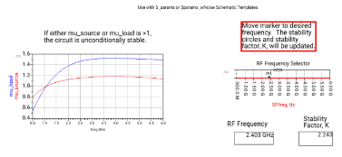
</p>

<p align="center">
  <b>Stability Analysis Result</b>
</p>

<p align="center">
  
  
</p>

또한 Transistor의 정상적인 동작을 위해 Bias Point를 설정했습니다.

```text
VDS = 28V
VGS = -2.7V
IDS ≈ 211mA
```

<p align="center">
  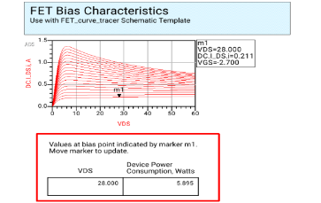
</p>

<p align="center">
  <b>CGH40010F Bias Point & I-V Characteristics</b>
</p>

---

## 3-2. RF Power Amplifier 기본 회로 구성

CGH40010F를 중심으로 Bias Network, Input / Output Matching Network 및 Harmonic Filter를 포함한 Power Amplifier의 기본 구조를 구성했습니다.

```text
RF Input
   ↓
Input Matching
   ↓
CGH40010F
   ↓
Output Matching
   ↓
Harmonic Filter
   ↓
RF Output
```

<p align="center">
  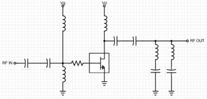
</p>

<p align="center">
  <b>RF Power Amplifier Basic Circuit Structure</b>
</p>

---

## 3-3. Smith Chart 기반 Input / Output Impedance Matching

GaN Transistor와 RF System의 기준 Impedance인 `50Ω` 사이의 부정합을 줄이기 위해 Input / Output Matching Network를 설계했습니다.

S-Parameter를 기반으로 Transistor의 Impedance 특성을 분석하고 **Smith Chart와 LC Network를 이용해 Impedance Matching**을 진행했습니다.

```text
Transistor Impedance
        ↓
Smith Chart 분석
        ↓
L / C 값 선정
        ↓
50Ω 방향으로 Impedance 이동
        ↓
S11 / S22 확인
        ↓
Matching 검증
```

최종적으로

```text
2.3GHz ~ 2.5GHz
S11 < -10dB
```

수준의 Input Matching 특성을 확보했습니다.

또한 2.4GHz에서 약

```text
S21 ≈ 12.5dB
```

의 Gain을 확인했습니다.

<p align="center">
  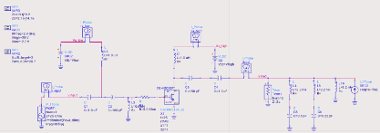
</p>

<p align="center">
  <b>CGH40010F Power Amplifier Schematic</b>
</p>

---

## 3-4. Harmonic Balance 및 Harmonic Trap 설계

Power Amplifier는 큰 입력 신호에서 Transistor가 비선형적으로 동작하기 때문에 기본 주파수뿐만 아니라 2차 · 3차 Harmonic이 함께 발생합니다.

ADS Harmonic Balance Simulation을 이용해

- Fundamental
- 2nd Harmonic
- 3rd Harmonic
- Output Power
- PAE
- Drain Efficiency

를 분석했습니다.

Filter 적용 이전에는 Harmonic 영역에서 비교적 큰 Power가 나타났기 때문에 **L과 C를 이용한 Harmonic Trap Circuit**을 추가했습니다.

```text
2.4GHz Fundamental
        ↓
Power Amplifier
        ↓
LC Harmonic Trap
        ↓
4.8GHz / 7.2GHz Harmonic 억제
        ↓
Output Spectrum 개선
```

<p align="center">
  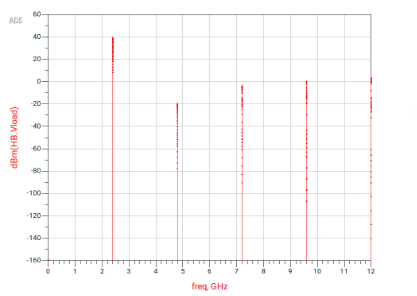
</p>

<p align="center">
  <b>Harmonic Balance Simulation Result</b>
</p>

---

## 3-5. Output Power 및 Saturation 특성 분석

Input Power를 증가시키면서 Output Power의 변화를 분석했습니다.

```text
Input Power 증가
        ↓
Output Power 증가
        ↓
약 33dBm까지 선형적 증가
        ↓
34dBm 이후 Saturation
        ↓
Gain Compression / Harmonic 증가
```

Schematic Simulation에서는 입력 전력이 증가함에 따라 Output Power가 증가하다가 약 33 ~ 34dBm 이후 포화 영역에 도달하는 것을 확인했습니다.

<p align="center">
  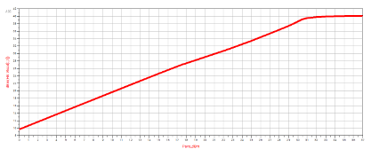
</p>

<p align="center">
  <b>Input Power vs Output Power — Schematic Simulation</b>
</p>

---

## 3-6. 실제 Component Size 기반 PCB Layout 설계

Schematic에서는 Component와 배선이 이상적인 회로 요소로 표현되지만 실제 PCB에서는 소자의 크기와 Routing 자체가 RF 특성에 영향을 줍니다.

따라서 실제 제작 환경을 고려해

- Capacitor Package
- Inductor Package
- CGH40010F Pad
- Signal Routing
- GND Via
- Substrate
- Metal Thickness

등을 반영한 PCB Layout을 구성했습니다.

특히 Capacitor와 Inductor는 RF Component Data Sheet에 명시된 실제 크기를 기준으로 Layout에 반영했습니다.

<p align="center">
  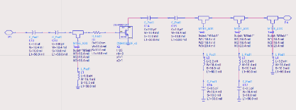
</p>

<p align="center">
  <b>Layout Simulation Circuit</b>
</p>

<p align="center">
  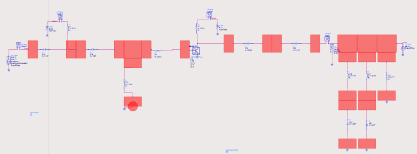
</p>

<p align="center">
  <b>ADS PCB Layout</b>
</p>

---

## 3-7. ADS Momentum 기반 EM Simulation

완성한 PCB Layout을 ADS Momentum에서 해석했습니다.

Momentum Simulation에서는 Schematic 단계에서 직접적으로 고려하기 어려운

- Routing의 Parasitic Inductance
- Pad 간 Parasitic Capacitance
- Via
- PCB Material
- Metal Thickness
- RF Routing

의 영향을 포함할 수 있습니다.

```text
Schematic
    ↓
Ideal Circuit Simulation
    ↓
PCB Layout
    ↓
Physical Structure 반영
    ↓
Momentum EM Simulation
    ↓
Schematic / Layout 결과 비교
```

Layout 기반 Simulation에서는 Smith Chart를 통해 Input / Output Matching 상태를 다시 확인하고 Harmonic 성분도 함께 분석했습니다.

<p align="center">
  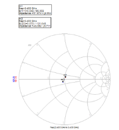
  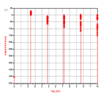
</p>

<p align="center">
  <b>Layout-based Matching & Harmonic Simulation</b>
</p>

Layout Simulation 기준으로 2차 Harmonic인

```text
4.8GHz ≤ 약 4dBm
```

수준의 결과를 확인했습니다.

---

## 3-8. Layout 기반 Output Power 분석

실제 PCB Layout의 영향을 포함한 상태에서 Input Power와 Output Power의 관계를 다시 분석했습니다.

<p align="center">
  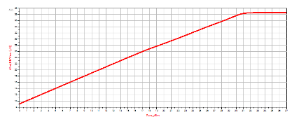
</p>

<p align="center">
  <b>Input Power vs Output Power — Layout Simulation</b>
</p>

최종 Layout Simulation에서는

```text
Maximum Pout = 42.3dBm

Drain Efficiency = 75.74%

PAE = 62.2%
```

수준의 성능을 확보했습니다.

---

## 3-9. S-Parameter 기반 최종 RF 특성 검증

최종 Layout에서 주파수에 따른 S-Parameter를 분석해 Input / Output Matching 및 Gain 특성을 검증했습니다.

### S11

S11은 Input Reflection Coefficient로 입력 신호가 얼마나 반사되는지를 나타냅니다.

2.3GHz ~ 2.5GHz에서

```text
S11 < -10dB
```

수준을 유지하는 것을 확인했습니다.

<p align="center">
  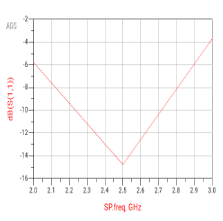
</p>

### S21

S21은 Forward Transmission 특성을 나타내며 2.4GHz에서 약

```text
S21 ≈ 12.5dB
```

수준의 Gain을 확인했습니다.

<p align="center">
  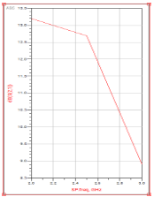
</p>

### S12

S12는 Reverse Transmission Coefficient로 역방향 신호 전달 특성을 분석했습니다.

<p align="center">
  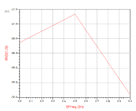
</p>

### S22

S22를 이용해 Output Port의 Reflection 특성을 확인했습니다.

<p align="center">
  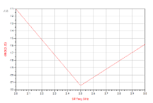
</p>

</details>

---

<details>
<summary><b>04. Troubleshooting ⭐</b></summary>

<br>

## Trouble 01. CGH40010F Layout 정보 부재로 EM Simulation을 수행할 수 없는 문제

### Problem

제조사에서 제공한 CGH40010F Model에는 회로 Simulation을 위한 정보가 존재했지만 **Momentum에서 사용할 수 있는 실제 Transistor Layout 정보가 포함되어 있지 않았습니다.**

따라서 Schematic Simulation은 가능했지만 PCB Layout으로 변환해 EM Simulation을 수행하기 어려운 문제가 발생했습니다.

### Analysis

Momentum은 단순한 Electrical Model이 아니라 실제

- Metal Pattern
- Pad
- Routing
- Via
- Substrate

구조를 기반으로 전자기장을 계산합니다.

따라서 회로 Model과 Layout Model은 서로 다른 정보이며 **EM Simulation을 위한 Physical Model을 별도로 구성해야 한다고 판단했습니다.**

### Solution

CGH40010F 제조사의 권장 구조와 Model 정보를 분석해

- Gate
- Drain
- Source
- Metal Pad

구조를 직접 Layout으로 구현했습니다.

```text
CGH40010F 자료 확인
        ↓
Gate / Drain / Source 구조 분석
        ↓
Physical Pad 구성
        ↓
Metal Pattern 직접 구현
        ↓
Signal Routing 연결
        ↓
GND Via 구성
        ↓
Momentum Port 설정
        ↓
EM Simulation
```

또한

- Substrate Material
- Substrate Height
- Metal Layer
- Component Size
- GND Via

를 함께 반영했습니다.

### Result

CGH40010F가 포함된 전체 PCB Layout에 대해 Momentum EM Simulation을 수행할 수 있게 되었습니다.

단순 Schematic 단계에서 끝나지 않고 **실제 PCB 생산 환경을 고려한 RF Layout 설계 및 EM 검증 경험**을 확보했습니다.

<p align="center">
  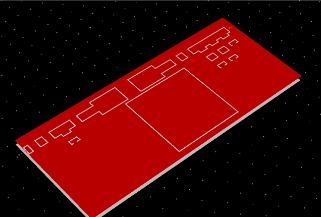
</p>

<p align="center">
  <b>CGH40010F를 포함한 최종 PCB Layout</b>
</p>

> **Learned**  
> RF 설계에서는 Electrical Model뿐 아니라 **실제 구조를 표현하는 Physical Layout Model을 이해하고 직접 구성할 수 있어야 한다는 점**을 배웠습니다.

---

## Trouble 02. Schematic과 PCB Layout Simulation의 Output Power 차이

### Problem

Schematic Simulation에서는 최대 Output Power가 약

```text
43.35dBm
```

까지 나타났지만 PCB Layout 기반 Simulation에서는 약

```text
42.31dBm
```

수준으로 감소했습니다.

동일한 Transistor와 Matching Network를 사용했음에도 Simulation 단계에 따라 성능 차이가 발생했습니다.

### Analysis

Schematic에서는 배선과 연결이 이상적으로 표현되지만 실제 PCB에서는

```text
Routing
+
Pad
+
Via
+
Substrate
        ↓
Parasitic Inductance
+
Parasitic Capacitance
```

가 추가됩니다.

따라서 Layout의 물리 구조가 Input / Output Matching과 RF 전달 특성을 변화시키면서 Output Power 차이가 발생했다고 판단했습니다.

### Solution

Momentum EM Simulation을 이용해 실제 PCB 구조의 영향을 분석하며

- 불필요한 Metal Routing 제거
- 불필요한 Via 최소화
- Component 간 배선 길이 검토
- Metal Thickness 반영
- Substrate Dielectric 특성 반영
- Component Physical Size 반영

등을 수행했습니다.

단순히 Schematic을 Layout으로 변환하는 것이 아니라 **RF Signal Path를 기준으로 Routing 구조를 검토**했습니다.

### Result

Schematic 대비 일부 출력 감소는 발생했지만 최종 Layout 환경에서도

```text
Pout = 42.3dBm
DE   = 75.74%
PAE  = 62.2%
```

수준의 성능을 확보했습니다.

> **Learned**  
> RF 회로에서는 Schematic 결과가 그대로 실제 PCB 성능으로 이어지지 않으며, **Layout에서 발생하는 Parasitic 성분을 포함해 검증해야 한다는 점**을 체감했습니다.

---

## Trouble 03. Harmonic 성분으로 인한 출력 신호 왜곡

### Problem

Large Signal Simulation 과정에서 기본 주파수인 2.4GHz 이외에도 2차 · 3차 Harmonic 성분이 발생했습니다.

특히 Filter 설계 이전에는 Harmonic 영역에서 비교적 큰 Power가 나타나 출력 신호의 왜곡 가능성이 있었습니다.

### Analysis

Power Amplifier는 큰 입력 신호에서 Transistor가 비선형적으로 동작하기 때문에

```text
2.4GHz × 2 = 4.8GHz
2.4GHz × 3 = 7.2GHz
```

와 같은 Harmonic이 발생합니다.

단순히 Impedance Matching만 개선하는 것으로는 해당 문제를 해결하기 어렵기 때문에 별도의 Harmonic 억제 구조가 필요하다고 판단했습니다.

### Solution

특정 Harmonic Frequency에서 낮은 Impedance Path를 형성하도록 **L과 C를 이용한 Harmonic Trap Circuit**을 추가했습니다.

Harmonic Balance Simulation을 반복하며 기본파의 Output Power를 유지하면서 Harmonic 성분이 감소하도록 L / C Parameter를 조정했습니다.

### Result

Layout Simulation에서 2차 Harmonic인

```text
4.8GHz ≤ 약 4dBm
```

수준으로 낮춰 기본파 대비 Harmonic 성분을 억제했습니다.

> **Learned**  
> Power Amplifier에서는 높은 Gain과 Output Power뿐 아니라 **비선형 동작으로 발생하는 Harmonic까지 함께 고려해야 RF 출력 품질을 확보할 수 있다는 점**을 배웠습니다.

---

## Trouble 04. 회로 성능과 실제 PCB 구현 가능성을 동시에 고려해야 하는 문제

### Problem

초기에는 Schematic Simulation 결과를 중심으로 Matching과 Efficiency를 조정했지만 Layout으로 변환하면서 실제 Component Size와 Routing 공간 때문에 회로도와 동일한 구조를 그대로 구현하기 어려운 부분이 발생했습니다.

### Analysis

RF 회로에서는

```text
Electrical Performance
        +
Physical Layout
        +
PCB Manufacturability
```

를 함께 고려해야 한다고 판단했습니다.

회로도에서 최적의 Component 값을 찾는 것과 실제 PCB에서 해당 Component를 배치하고 짧은 RF Path를 만드는 것은 서로 다른 문제였습니다.

### Solution

Layout 설계 시 Schematic의 배치를 그대로 옮기지 않고 RF Signal Path를 기준으로 Component 위치를 조정했습니다.

또한

- Component Package Size
- Gate / Drain 연결 구조
- RF Signal Path
- Ground Path
- GND Via 위치

를 함께 검토했습니다.

### Result

회로 Simulation에서 끝나지 않고 Layout 기반 EM Simulation까지 완료해 **Electrical Design과 Physical Design을 연결한 RF 설계 과정**을 경험했습니다.

<p align="center">
  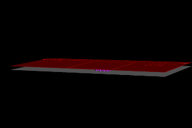
</p>

<p align="center">
  <b>Final RF Power Amplifier PCB Layout</b>
</p>

> **Learned**  
> 실제 제품을 고려한 회로 설계에서는 Simulation 결과뿐 아니라 **PCB에서 실제 구현 가능한 구조인지까지 고려해야 설계가 완성된다는 점**을 배웠습니다.

</details>

---

<details>
<summary><b>05. 결과 및 성과</b></summary>

<br>

- CGH40010F GaN HEMT 기반 **2.4GHz RF Power Amplifier 설계**
- `VDS = 28V`, `VGS = -2.7V` 기준 Bias Point 설정
- 2.4GHz에서 **Stability Factor K = 2.243**
- Smith Chart + LC Network 기반 **Input / Output Impedance Matching**
- `2.3GHz ~ 2.5GHz`에서 **S11 < -10dB**
- 2.4GHz에서 약 **12.5dB Gain**
- Harmonic Balance 기반 **Large Signal 특성 분석**
- LC Harmonic Trap 적용을 통한 **2차 Harmonic 억제**
- 실제 Component · Via · Substrate를 반영한 **PCB Layout 설계**
- 제조사에서 제공되지 않은 **CGH40010F Physical Layout 직접 구현**
- ADS Momentum 기반 **EM Simulation 수행**
- Maximum Output Power **42.3dBm**
- Drain Efficiency **75.74%**
- PAE **62.2%**
- 기존 비교 연구 대비 Output Power **+0.3dBm**
- Drain Efficiency **+11.74%p**
- PAE **+4.6%p**

### Final Performance

| Parameter | Result |
|---|---:|
| Operating Frequency | **2.4GHz** |
| Maximum Output Power | **42.3dBm** |
| Drain Efficiency | **75.74%** |
| PAE | **62.2%** |
| Gain @ 2.4GHz | **약 12.5dB** |
| Stability Factor K | **2.243** |
| Input Matching | **S11 < -10dB @ 2.3 ~ 2.5GHz** |
| 2nd Harmonic | **약 4dBm 이하 @ 4.8GHz** |

### 기존 연구와 성능 비교

| Parameter | Reference | 본 프로젝트 | Improvement |
|---|---:|---:|---:|
| Output Power | 42dBm | **42.3dBm** | **+0.3dBm** |
| Drain Efficiency | 64% | **75.74%** | **+11.74%p** |
| PAE | 57.6% | **62.2%** | **+4.6%p** |

### 핵심 설계 Flow

```text
Device Analysis
        ↓
Circuit Design
        ↓
S-Parameter
        ↓
Impedance Matching
        ↓
Harmonic Analysis
        ↓
PCB Layout
        ↓
EM Simulation
        ↓
Performance Verification
```

</details>

---

<details>
<summary><b>06. 회고 / 배운 점</b></summary>

<br>

이번 프로젝트를 통해 RF 회로에서는 **Schematic에서 좋은 Simulation 결과를 얻는 것만으로 설계가 끝나는 것이 아니라는 점**을 배웠습니다.

처음에는 회로도에서 Matching과 Output Power를 확보하면 Layout에서도 유사한 결과가 나올 것으로 생각했지만, 실제 PCB 구조를 적용하면서 Routing · Pad · Via · Substrate에서 발생하는 Parasitic 성분으로 인해 RF 특성이 달라지는 것을 확인했습니다.

이를 해결하면서

```text
Bias 설정
   ↓
S-Parameter 분석
   ↓
Stability 검증
   ↓
Impedance Matching
   ↓
Harmonic Balance
   ↓
PCB Layout
   ↓
Momentum EM Simulation
```

으로 이어지는 RF Power Amplifier의 전체 설계 흐름을 경험했습니다.

특히 CGH40010F의 Layout 정보가 제공되지 않는 상황에서 제조사 자료와 Model 정보를 기반으로 Gate · Drain · Source의 Physical Structure를 직접 구성하면서 **주어진 Model에 의존하지 않고 부족한 정보를 분석해 필요한 구조를 직접 구현하는 문제 해결 경험**을 얻었습니다.

또한 Schematic과 Layout Simulation 결과를 비교하며 RF 회로에서는 Component 값뿐만 아니라

- 배선 길이
- Pad
- Via
- Substrate
- Component Physical Size

와 같은 **물리적 구조 자체가 하나의 회로 요소로 작용한다는 점**을 체감했습니다.

Harmonic 문제를 해결하는 과정에서는 높은 Output Power만 확보하는 것이 아니라

**Gain · Efficiency · Stability · Matching · Harmonic**

을 함께 고려해야 한다는 점도 배웠습니다.

최종적으로

> **소자 특성 분석 → 회로 설계 → Simulation → Troubleshooting → PCB Layout → EM 검증**

까지 이어지는 RF 설계 전 과정을 경험하며 **회로의 전기적 성능과 실제 구현 가능성을 함께 고려하는 설계 관점**을 익혔습니다.

</details>

---

## Project Contribution

| 구분 | 담당 |
|---|---|
| PCB Layout Design | ✅ |
| Small Signal Simulation | ✅ |
| Momentum EM Simulation | ✅ |
| RF Circuit Analysis | ✅ |
| Proposal Documentation | ✅ |

---

## Reference

- *Design and Optimization of the GaN HEMT Class-J Power Amplifier for 2.4GHz Applications*, 2024
- *Measurements on CREE CGH40010F Evaluation Board PA*, 2020
- D. M. Pozar, *Microwave Engineering*, 2018
