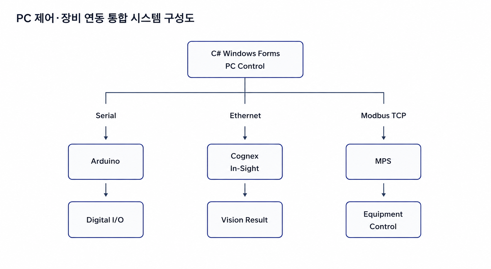
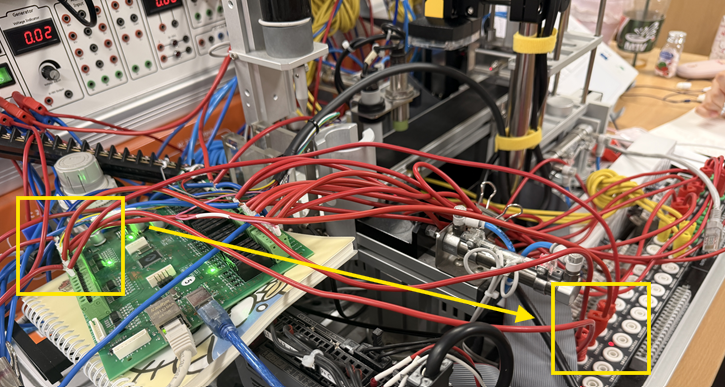
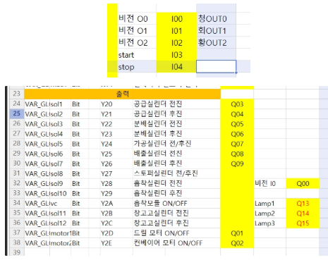
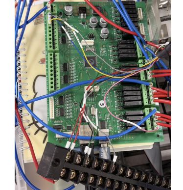
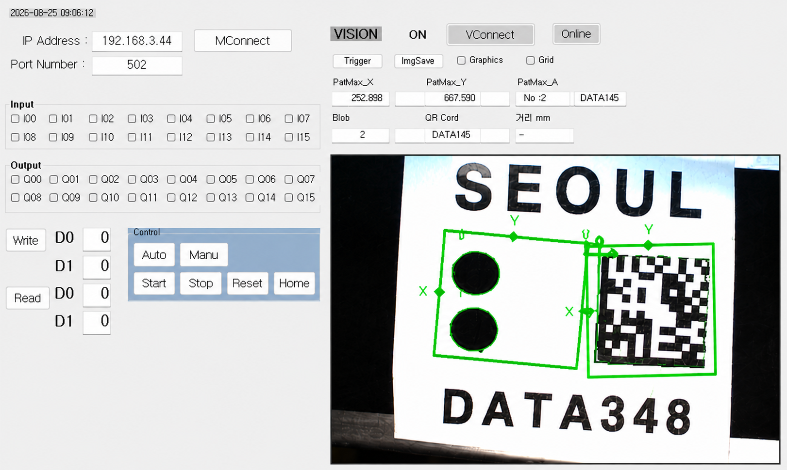

# C# · Arduino · Cognex 기반 PC 제어 및 비전 자동화 시스템

### Windows Forms · Cognex In-Sight · Modbus TCP · MPS 장비 연동

> **C# 기반 PC 제어 프로그램에 Arduino I/O와 Cognex 비전 검사를 통합하고,  
> 검사 결과를 MPS 장비의 후속 제어까지 연결한 산업자동화 시스템**

* **기간**: 2026.07 - 08
* **참여 형태**: 개인
* **주요 기술**: C#, Windows Forms, Arduino, Cognex In-Sight, Serial, Ethernet, Modbus TCP, EasyModbus, MPS

---

## 시스템 구성

<p align="center">
  
</p>

* **PC · Arduino 제어 흐름**  
  `C# Windows Forms → Serial → Arduino → Digital I/O`

* **비전검사 흐름**  
  `Cognex In-Sight → C# 검사 결과 수신 → 판정`

* **설비 제어 흐름**  
  `C# Windows Forms → Modbus TCP → MPS → Equipment Control`

---

<details>
<summary><b>01. 프로젝트 개요 및 목표</b></summary>

<br>

C# Windows Forms 기반 PC 제어 프로그램을 제작하고 **Arduino, Cognex In-Sight 비전 카메라, MPS 자동화 장비를 Serial 및 Ethernet 통신으로 연동**했습니다.

PC 프로그램에서 장비의 Digital I/O 및 운전 상태를 확인하고 직접 제어할 수 있도록 구성했으며, Cognex SDK를 적용하여 **카메라 영상과 검사 결과를 하나의 PC 제어 화면에서 확인**할 수 있도록 구현했습니다.

Cognex In-Sight에서는 **PatMax 패턴 매칭, Blob 검출, QR Code 판독**을 이용하여 제품을 검사하고, 검사 결과를 C# 프로그램에서 실시간으로 확인했습니다.

이후 판정 결과를 제어 신호와 연계하여 후속 장비가 동작하도록 구성하면서

**입출력 제어 → 비전 검사 → 판정 → 장비 제어**

로 이어지는 자동화 시스템의 전체 흐름을 실습했습니다.

</details>

---

<details>
<summary><b>02. 사용 기술 / 툴</b></summary>

<br>

| 구분 | 기술 / 툴 |
|---|---|
| PC Control | C# / Windows Forms |
| MCU | Arduino |
| Vision | Cognex In-Sight / In-Sight Explorer |
| Vision SDK | Cognex In-Sight SDK |
| Vision Tool | PatMax / Blob / QR Code |
| Serial | SerialPort |
| Network | Ethernet / TCP/IP |
| Protocol | Modbus TCP |
| Library | EasyModbus |
| I/O | Digital Input / Output, DC 24V |
| Equipment | MPS Automation System |

</details>

---

<details>
<summary><b>03. 주요 구현 내용</b></summary>

<br>

### 3-1. C# 기반 PC 제어 및 Arduino I/O 연동

Windows Forms를 이용하여 작업자가 장비 상태를 확인하고 직접 제어할 수 있는 PC 제어 화면을 구성했습니다.

Arduino와는 Serial 통신으로 연결하여 외부 Digital Input 상태를 PC에서 확인하고, PC에서 전달한 명령에 따라 Lamp, Buzzer, Conveyor 등의 출력을 제어했습니다.

#### 주요 기능

* COM Port 선택 및 Connect / Disconnect
* Digital Input 상태 모니터링
* Digital Output ON / OFF 제어
* Start / Stop / Auto 운전
* 연결 상태에 따른 Button 상태 표시
* DC 24V 산업용 I/O 처리
* Lamp / Buzzer / Conveyor 제어

```text
Operator
   ↓
C# Windows Forms
   ↕
Serial Communication
   ↕
Arduino
   ↓
Digital I/O
   ↓
Lamp / Buzzer / Conveyor
```

PC에서 장비를 직접 조작하면서 입출력 상태를 동시에 확인할 수 있도록 하여 **PC 기반 장비 제어 화면과 실제 I/O를 연동**했습니다.

<br>

<table>
  <tr>
    <th width="50%">I/O Mapping Table</th>
    <th width="50%">Arduino · I/O Board 실제 배선</th>
  </tr>
  <tr>
    <td align="center">
      
    </td>
    <td align="center">
      
    </td>
  </tr>
  <tr>
    <td align="center">
      Arduino·MPS 입출력 신호 및 Address Mapping
    </td>
    <td align="center">
      Arduino와 산업용 I/O Board 실제 배선 및 신호 연동
    </td>
  </tr>
</table>

<br>

---

### 3-2. Cognex 비전검사 및 C# 프로그램 통합

Cognex In-Sight 카메라를 Ethernet으로 연결하고 In-Sight Explorer에서 제품 검사 조건을 구성했습니다.

제품 이미지에서 필요한 정보를 판별하기 위해 다음 Vision Tool을 적용했습니다.

| 기능 | 적용 내용 |
|---|---|
| PatMax | 패턴 매칭을 통한 대상 위치 및 형상 확인 |
| Blob | 객체 및 영역 검출 |
| QR Code | 제품 정보 판독 |

```text
Inspection Target
        ↓
Cognex In-Sight
        ↓
PatMax / Blob / QR Code
        ↓
Inspection Result
        ↓
C# PC Control
```

Cognex SDK를 Windows Forms에 적용하여 별도의 In-Sight Explorer 화면에서 끝나는 것이 아니라 **자체 PC 제어 프로그램에서 카메라 영상과 검사 결과를 확인**할 수 있도록 구성했습니다.

사용한 주요 라이브러리는 다음과 같습니다.

```csharp
using Cognex.InSight;
using Cognex.InSight.Cell;
using Cognex.InSight.Controls;
using Cognex.InSight.Extensions;
using Cognex.InSight.Graphic;
using Cognex.InSight.Sensor;
```

또한 PC 프로그램에서 Software Trigger를 실행하거나 외부 입력을 통해 카메라 Trigger가 동작하도록 구성했습니다.

#### 주요 구현 기능

* Cognex Camera Network 연결
* Image Acquisition
* PatMax / Blob / QR Code 검사
* 검사 결과 데이터 생성
* C# 프로그램 내 Camera View 표시
* Vision Result 실시간 확인
* Software Trigger
* External Trigger

<p align="center">
  
</p>

---

### 3-3. 비전 판정 결과 기반 MPS 장비 제어

Cognex 검사 결과가 프로그램 내부에서 끝나지 않고 **실제 자동화 설비의 후속 동작으로 이어지도록 제어 흐름을 구성**했습니다.

```text
Cognex Vision Camera
        ↓
PatMax / Blob / QR Code
        ↓
C# 판정 로직
        ↓
Arduino / Control Signal
        ↓
MPS
        ↓
Equipment Control
```

검사 결과를 C#에서 확인하고 기준값과 비교한 뒤, 후속 장비 제어에 사용할 수 있도록 결과 데이터를 연계했습니다.

또한 C# 프로그램과 MPS 사이에는 **Modbus TCP**를 적용했습니다.

`EasyModbus`를 이용해 MPS의 Digital I/O와 Holding Register 데이터를 읽고 쓸 수 있도록 구성했습니다.

```csharp
ModbusClient modbus = new ModbusClient();
```

#### Modbus TCP 구현 기능

* IP / Port 설정
* Connect / Disconnect
* Discrete Input Read
* Coil Write
* Holding Register Read / Write
* MPS I/O 상태 모니터링
* Auto / Start / Stop 명령 전달

```text
C# PC Control
      ↕
 Modbus TCP
      ↕
     MPS
      ↓
Equipment Control
```

이를 통해 **PC 제어 → 비전 검사 → 판정 → 후속 장비 제어**가 연결되는 자동화 시스템의 데이터 흐름을 구성했습니다.

<br>

#### 비전검사 프로그램 및 실제 장비 연동

| 비전검사 제어 프로그램 | 실제 장비 연동 |
| :---: | :---: |
|  |  |
| PatMax·Blob·QR Code 판독 결과 및 장비 상태 모니터링 | Cognex Camera·Arduino·MPS 실제 배선 및 장비 연동 |

</details>

---

<details>
<summary><b>04. 트러블슈팅</b></summary>

<br>

### Trouble 01. Arduino Input 신호가 입력되지 않는 문제

#### Problem

외부 입력 장치를 연결했지만 Arduino의 Input LED가 점등되지 않았고 입력 신호도 인식되지 않았습니다.

#### Analysis

처음에는 프로그램 문제 가능성을 확인했지만, 입력 신호가 Controller까지 전달되는 경로를 다시 점검했습니다.

```text
Power
  ↓
COM
  ↓
Input Signal
  ↓
Arduino
```

배선을 확인한 결과 **산업용 Input 단자의 COM(+24V) 연결이 누락**되어 입력 회로가 정상적으로 구성되지 않은 것을 확인했습니다.

#### Solution

COM 단자에 +24V를 연결하여 입력 회로를 완성했습니다.

#### Result

Arduino Input LED가 정상적으로 점등되고 외부 입력 신호를 정상적으로 읽을 수 있었습니다.

> **Learned**  
> 프로그램 오류처럼 보이는 문제라도 먼저 **전원 → COM → 배선 → Controller → Software** 순서로 실제 신호 경로를 확인해야 한다는 점을 경험했습니다.

---

### Trouble 02. Arduino Input은 정상이나 PC 화면에 표시되지 않는 문제

#### Problem

Arduino에서는 외부 Input 신호가 정상적으로 확인됐지만 C# PC 제어 화면에서는 Input 상태가 변경되지 않았습니다.

#### Analysis

입력부터 PC 화면까지의 데이터 흐름을 단계별로 나누어 확인했습니다.

```text
Physical Input      정상
      ↓
Arduino Input       정상
      ↓
Data Processing     문제 확인
      ↓
Serial Communication
      ↓
PC Display
```

물리적인 Input까지 정상인 것을 확인한 뒤 Arduino 코드의 데이터 처리 부분을 점검했습니다.

Digital Input 배열을 읽는 함수가 특정 코드 조건으로 인해 실행되지 않아 입력 데이터가 PC로 전달되지 않고 있었습니다.

#### Solution

해당 조건을 수정하여 Digital Input 배열을 정상적으로 읽고 PC로 전달하도록 변경했습니다.

#### Result

C# PC 제어 화면에서 외부 Input 상태가 정상적으로 표시되는 것을 확인했습니다.

> **Learned**  
> 통신 문제를 하나의 영역으로 보지 않고  
> **Physical I/O → Controller → Data Processing → Communication → PC Display**  
> 순서로 분리하여 확인하면 문제 발생 위치를 효율적으로 특정할 수 있다는 점을 배웠습니다.

</details>

---

<details>
<summary><b>05. 결과 및 성과</b></summary>

<br>

* C# Windows Forms 기반 **PC 장비 제어 화면 구현**
* Arduino와 Serial 통신을 통한 **산업용 Digital I/O 제어**
* Cognex In-Sight와 C# 프로그램 **SDK 연동**
* PC 프로그램 내 **Cognex Camera View 및 검사 결과 통합**
* **PatMax · Blob · QR Code** 기반 제품 검사
* Software / External Trigger를 이용한 이미지 취득
* EasyModbus 기반 **Modbus TCP 통신 구현**
* PC에서 MPS Digital I/O 및 Holding Register 제어
* 비전 검사 결과와 **실제 장비 후속 동작 연계**
* 배선 및 데이터 흐름 기반 **계층별 Troubleshooting 경험 확보**

</details>

---

<details>
<summary><b>06. 회고 / 배운 점</b></summary>

<br>

이번 프로젝트를 통해 단순히 C# 프로그램, Arduino, Cognex 카메라를 각각 사용하는 것이 아니라 **서로 다른 장비와 통신 방식을 하나의 제어 시스템으로 연결하는 과정**을 경험했습니다.

특히 비전 카메라의 검사 결과를 PC 화면에 표시하는 데 그치지 않고 후속 장비의 제어 데이터로 활용하면서 머신비전이 자동화 설비에서 **판정 센서이자 제어 입력 데이터**로 사용되는 구조를 이해했습니다.

또한 I/O 및 통신 문제를 해결하면서 프로그램만 확인하는 방식에서 벗어나

**Physical I/O → Controller → Communication → PC Control → Vision → Equipment**

으로 이어지는 전체 데이터 흐름을 기준으로 문제를 분석하는 방법을 익혔습니다.

</details>
